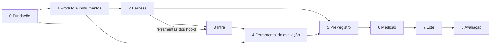

# Tasks — Fase 1: construir do zero

Divisão do `plan.md` em fases de desenvolvimento executáveis. O plano diz **o
que** o experimento é; este arquivo diz **em que ordem construir**, o que cada
peça entrega e quando ela está pronta.

## Como ler

- **Fases** agrupam trabalho do mesmo tipo e com as mesmas dependências. Cada
  fase termina num **portão**: uma condição verificável que precisa passar antes
  de a fase seguinte começar. Os portões existem porque o piloto mostrou o custo
  de descobrir defeito depois de gastar cota.
- **IDs** `T<fase>.<n>`. Cada tarefa traz *entrega* (o arquivo ou resultado),
  *depende de* e *pronto quando*.
- **[você]** marca tarefas que só o usuário pode fazer — revisão de conteúdo,
  decisões de seguir, pontuação cega.
- **[paralela]** marca tarefas que podem andar ao mesmo tempo que outras.

## Visão geral

| Fase | Objetivo | Portão de saída |
|---|---|---|
| 0 | Fundação do diretório | Credencial falsa ignorada pelo git |
| 1 | Produto e instrumentos de medição | Anti-vazamento limpo; todo critério tem passo no roteiro |
| 2 | Harness do braço B | `HASH` gravado; hooks disparam em headless |
| 3 | Infraestrutura de execução | Testes com CLI stub e de isolamento verdes |
| 4 | Ferramental de avaliação | Pipeline de avaliação roda ponta a ponta numa app real |
| 5 | Pré-registro | Tag `preregistro-v1` no git |
| 6 | Rodada de medição (fora do conjunto) | Seu "go" + tag `pipeline-v1` |
| 7 | Lote de 20 runs | 20 runs válidas com manipulação conferida |
| 8 | Avaliação e análise | Relatório com κ ≥ 0,6 e tempo por run |

A Fase 3 começa logo depois da Fase 0 e anda em paralelo com as Fases 1 e 2. Só
a imagem base (T3.1) espera a lista de ferramentas dos hooks (T2.4).

## Ajustes ao `plan.md` encontrados na análise

Pontos em que a ordem das Etapas do plano não fecha. As tarefas abaixo já
seguem a ordem corrigida.

1. **Pontos de pressão vêm antes dos requisitos.** O plano escreve
   `requisitos.md` na Etapa 1 e os pontos de pressão na Etapa 2. Mas são as
   histórias que criam a pressão de design: sem os pontos definidos, nada
   garante que os requisitos exercitem P1–P6.
2. **Falta uma app real para construir o ferramental de avaliação.** O
   verificador, o juiz e os coletores precisam de uma app para serem
   desenvolvidos, e a rodada de medição chega tarde demais para isso — o
   pré-registro já estaria fechado. Acrescentada a **run de fumaça** (T4.1),
   fora de qualquer conjunto de dados.
3. **A imagem base depende do harness.** As ferramentas dos hooks ficam na
   imagem para os dois braços, então a lista delas (T2.4) precisa existir antes
   de fechar a imagem (T3.1).
4. **Hook num workspace vazio.** O braço B começa sem projeto. Um hook de
   compilação que falha quando ainda não há `pom.xml` derrubaria a run por
   motivo de infraestrutura. Coberto em T2.5.
5. **O juiz só pode ser calibrado depois do lote.** Na medição ele é testado só
   mecanicamente; κ ≥ 0,6 é verificado na Fase 8.
6. **Nome do arquivo.** O plano se refere a `plano-fase1-construcao.md`; o
   arquivo é `docs/plan.md`.

---

## Fase 0 — Fundação

**T0.1 · Estrutura de pastas**
- Entrega: `docs/`, `produto/`, `harness/`, `infra/`, `runner/`, `avaliacao/`,
  `analise/`, `dados/` e um `README.md` curto apontando para `docs/plan.md` e
  `docs/tasks.md`.
- Pronto quando: estrutura igual à seção *Estrutura* do plano.

**T0.2 · `.gitignore`**
- Entrega: ignora `dados/runs/**`, `dados/medicao/**`, `dados/fumaca/**`,
  `*.tar`, `*.tar.gz`, `node_modules/`, `target/` e **qualquer
  `.credentials.json`**.
- Pronto quando: `git check-ignore` confirma uma credencial falsa criada em
  `dados/runs/x/.credentials.json`.

**T0.3 · Registro de desvios**
- Entrega: `docs/registro.md`, vazio, com o formato de entrada (data, o que
  mudou, por quê, se afeta dados já coletados).
- Pronto quando: existe. É onde toda mudança feita depois do pré-registro fica
  declarada.

**Portão G0:** `git status` limpo e credencial falsa ignorada.

---

## Fase 1 — Produto e instrumentos de medição

Conteúdo, não código de execução. É o que o agente recebe e o que mede o
resultado — tudo aqui entra no hash do pré-registro.

**T1.1 · Pontos de pressão** [você revisa]
- Entrega: `avaliacao/pontos-de-pressao.md`, com P1–P6. Para cada um: o
  requisito de negócio que cria a pressão e o que conta como 0, 1 e 2 naquele
  ponto específico.
- Depende de: —
- Pronto quando: você aprovou os seis.

**T1.2 · Requisitos do produto**
- Entrega: `produto/requisitos.md` — histórias e critérios de aceitação em
  linguagem de negócio, ~6–8 entidades, cobrindo P1–P6 sem nomear solução.
- Depende de: T1.1
- Pronto quando: cada ponto de pressão aparece em pelo menos uma história, e
  não há lacuna que um desenvolvedor precisaria perguntar (ver T1.8).

**T1.3 · Prompt** [paralela a T1.5]
- Entrega: `produto/prompt.txt` — implementar o produto de `requisitos.md`,
  subir com um comando, entregar testes, "se algo não estiver especificado,
  decida e siga".
- Depende de: T1.2

**T1.4 · Checagem anti-vazamento**
- Entrega: `produto/checar-vazamento.py` com duas listas: termos de solução
  (proibidos em `requisitos.md` e `prompt.txt`) e termos do domínio (proibidos
  no harness). Código de saída ≠ 0 quando acha algo.
- Depende de: T1.2 (para extrair os termos do domínio)
- Pronto quando: passa nos arquivos reais e falha num arquivo de teste com um
  termo plantado de cada lista.

**T1.5 · Roteiro de aceitação** [paralela a T1.3]
- Entrega: `avaliacao/roteiro-aceitacao.md` — um passo verificável pela
  interface para cada critério de T1.2, com ID rastreável critério → passo.
- Depende de: T1.2
- Pronto quando: nenhum critério sem passo, nenhum passo sem critério.

**T1.6 · Rubrica** [paralela a T1.2–T1.5]
- Entrega: `avaliacao/rubrica.md` — escala 0/1/2 por ponto, com exemplo-âncora
  de cada nível, e a definição de excesso de engenharia com regra de contagem.
- Depende de: T1.1

**T1.7 · Prompt do juiz**
- Entrega: `avaliacao/juiz-prompt.md` — entrada: código anonimizado + rubrica;
  saída: JSON com nota, justificativa e evidência `arquivo:linha` por ponto.
- Depende de: T1.6
- Pronto quando: a saída tem um schema que o runner do juiz (T4.5) consegue
  validar.

**T1.8 · Revisão cruzada** [você]
- Entrega: leitura de `requisitos.md` como um desenvolvedor que vai implementar,
  anotando cada pergunta que faria; lacunas completadas em T1.2.
- Depende de: T1.2, T1.5
- Pronto quando: nenhuma pergunta pendente.

**Portão G1:** `checar-vazamento.py` limpo; rastreabilidade completa entre
critérios e roteiro; P1–P6 cobertos nos requisitos.

---

## Fase 2 — Harness do braço B

**T2.1 · Levantamento de fontes**
- Entrega: `harness/FONTES.md` com as fontes (documentação do Claude Code,
  2–3 harnesses públicos, guias de Spring Boot, estilo Java, React TS,
  Flyway/PostgreSQL, OWASP) e o **critério de seleção** dos harnesses públicos
  declarado antes de escolhê-los.
- Depende de: —

**T2.2 · `CLAUDE.md`**
- Entrega: regras sempre ativas nas 4 dimensões, cada uma com referência a
  `FONTES.md`. Design em tom geral ("aplique padrões de projeto quando julgar
  necessário").
- Depende de: T2.1

**T2.3 · Skills** [paralela a T2.2]
- Entrega: `harness/.claude/skills/` — design de baixo nível, testes, banco e
  migrações, arquitetura do back, front React TS. Cada uma com referência.
- Depende de: T2.1

**T2.4 · Hooks**
- Entrega: `harness/.claude/settings.json` com `PostToolUse` em Edit/Write
  (formatador, lint, compilação) **e** a lista de ferramentas com versão exata.
- Depende de: T2.1
- Pronto quando: a lista de ferramentas foi entregue para T3.1.

**T2.5 · Validação do harness**
- Entrega: evidência de que (a) `checar-vazamento.py` passa no harness; (b) os
  hooks disparam com `claude -p` — visível na transcrição; (c) os hooks não
  falham num workspace vazio nem num projeto que ainda não compila.
- Depende de: T1.4, T2.2, T2.3, T2.4
- Pronto quando: as três evidências estão registradas.

**T2.6 · Congelar**
- Entrega: `harness/HASH` com o sha256 da árvore.
- Depende de: T2.5

**Portão G2:** `HASH` gravado e as evidências de T2.5 registradas.

---

## Fase 3 — Infraestrutura de execução

Começa logo após a Fase 0. Só T3.1 espera T2.4.

**T3.1 · Imagem base**
- Entrega: `infra/Dockerfile.base` — JDK 21, Maven, Node, Claude Code CLI em
  versão fixa, ferramentas dos hooks para os dois braços, cache de dependências
  comuns, imagem do Postgres salva para `docker load`. Digest registrado.
- Depende de: T2.4 (as ferramentas); o resto pode ser montado antes.

**T3.2 · Run única isolada**
- Entrega: `infra/run.compose.yml` (ou script equivalente) — rede própria,
  DinD privilegiado, container da run com workspace vazio + `prompt.txt` +
  `requisitos.md` (+ harness só em B), `docker load` do Postgres no DinD.
- Depende de: T3.1

**T3.3 · Credencial e configuração**
- Entrega: credencial copiada só leitura, `CLAUDE_CONFIG_DIR` novo por run,
  `CLAUDE_CODE_DISABLE_AUTO_MEMORY=1`.
- Depende de: T3.2

**T3.4 · Runner do lote**
- Entrega: `runner/run-lote.sh`, evoluído de `teste-tcc/run-pilot.sh` —
  preflight (CLI, provedor, auth, digest, `HASH`), par A‖B simultâneo, blocos
  com ordem alternada, heartbeat, limite de 3h, 429 com horário de reset, pausa
  com dados operacionais (nunca A vs B), retomada, `runs.csv` e metadados.
- Depende de: T3.2, T3.3

**T3.5 · Verificação pós-run**
- Entrega: fora do agente — build, `docker compose up`, healthcheck do back,
  front respondendo → `dados/verificacao.csv`.
- Depende de: T3.4

**T3.6 · Arquivamento**
- Entrega: `git commit` do estado final do workspace, `tar.gz` da app,
  transcrição e `_result.json` guardados **sem `.credentials.json`**;
  container, rede e daemon destruídos.
- Depende de: T3.4

**T3.7 · Testes da infraestrutura**
- Entrega: suíte com CLI stub cobrindo sucesso, 429, timeout e JSON inválido
  (pausa, retomada, par incompleto, ordem alternada) e teste de isolamento com
  duas runs simultâneas.
- Depende de: T3.4, T3.5, T3.6
- Pronto quando: dentro de A, `docker ps` não vê B; `docker inspect` sem
  volume compartilhado; hash do workspace inicial igual nos dois braços exceto
  o harness; nenhum arquivo arquivado contém credencial.

**Portão G3:** T3.7 inteiro verde.

---

## Fase 4 — Ferramental de avaliação

**T4.1 · Run de fumaça** *(acrescentada ao plano)*
- Entrega: 1 run Sonnet sem harness, com a infraestrutura da Fase 3, guardada
  em `dados/fumaca/`. **Fora de qualquer conjunto de dados**, inclusive da
  medição.
- Depende de: G1, G3
- Pronto quando: existe uma app real para desenvolver T4.2–T4.7.

**T4.2 · Coletor de custo e comportamento**
- Entrega: `analise/metricas.py`, evoluído do piloto — transcrição achada por
  `session_id` no novo layout, pom aninhado, tempo de API e local, ferramentas,
  builds, reescritas.
- Depende de: T4.1

**T4.3 · Verificador funcional** [paralela]
- Entrega: `avaliacao/verificador/` — Playwright executando o roteiro de T1.5,
  cumprimento por critério em CSV.
- Depende de: T1.5, T4.1

**T4.4 · Anonimizador** [paralela]
- Entrega: `avaliacao/anonimizar.sh` — remove `CLAUDE.md`, `.claude/`,
  transcrição e identificadores de run; gera o mapa id-cego → run.
- Depende de: T4.1

**T4.5 · Runner do juiz**
- Entrega: executa `juiz-prompt.md` com `JUIZ_MODELO`, valida o JSON de saída,
  grava `dados/notas-juiz.csv`.
- Depende de: T1.7, T4.4

**T4.6 · Métricas estáticas** [paralela]
- Entrega: CK (CBO, LCOM, WMC), PMD, abstração especulativa, ESLint no front.
- Depende de: T4.1

**T4.7 · Validação de manipulação**
- Entrega: por par — hash do contexto inicial idêntico exceto o harness;
  instruções, skills e hooks presentes só em B; evidência de hook disparado em B.
- Depende de: T4.1 (e um par da medição, para o caso B)

**T4.8 · Análise**
- Entrega: `analise/analise.py`, evoluído do piloto — Mann-Whitney exato por
  modelo com Holm, Cliff's delta, interação por permutação, secundários com
  Holm, sensibilidade com apps ≥ 70% dos critérios, tempo por run.
- Depende de: —
- Pronto quando: acerta o resultado em dados sintéticos com efeito conhecido.

**Portão G4:** T4.2–T4.6 rodam ponta a ponta na app de fumaça; T4.8 passa nos
dados sintéticos.

---

## Fase 5 — Pré-registro

**T5.1 · Documento**
- Entrega: `docs/preregistro.md` — perguntas de pesquisa, desfecho primário,
  testes e correções, critérios de exclusão (`is_error` exclui; timeout é
  resultado), sensibilidade, regra do κ ≥ 0,6, e os hashes de `requisitos.md`,
  `prompt.txt`, `rubrica.md`, `juiz-prompt.md`, `roteiro-aceitacao.md` e
  `harness/HASH`.
- Depende de: G1, G2, G4

**T5.2 · Fechar** [você]
- Entrega: commit e tag `preregistro-v1`.
- Pronto quando: a tag existe. Daqui em diante, mudança de conteúdo só com
  entrada em `docs/registro.md`.

**Portão G5:** tag `preregistro-v1`.

---

## Fase 6 — Rodada de medição (fora do conjunto)

**T6.1 · Rodar**
- Entrega: 1 par Opus + 1 par Sonnet em `dados/medicao/`.
- Depende de: G5

**T6.2 · Pipeline completo**
- Entrega: verificação, verificador funcional, coletores, anonimização, juiz,
  métricas estáticas e validação de manipulação nas 4 apps.

**T6.3 · Corrigir mecânica**
- Entrega: defeitos corrigidos, cada um registrado em `docs/registro.md`. Só
  mecânica de pipeline — conteúdo congelado em G5 não muda.

**T6.4 · Estimar e decidir** [você]
- Entrega: custo e tempo reais por run → número de janelas de cota para as 20
  runs; decisão de seguir.

**T6.5 · Congelar pipeline**
- Entrega: digest da imagem e hash de `runner/`, `avaliacao/` e `analise/`;
  tag `pipeline-v1`.

**Portão G6:** seu "go" e tag `pipeline-v1`.

---

## Fase 7 — Lote

**Regra de cegagem para a fase inteira:** não abrir o código das runs nem
qualquer comparação entre A e B antes da calibração (T8.3).

**T7.1 · Executar** [você confirma cada par]
- Entrega: 5 blocos, 10 pares, 20 runs em `dados/runs/`.
- Depende de: G6

**T7.2 · Diário de execução**
- Entrega: `docs/diario-lote.md` — janelas de cota usadas, interrupções, 429,
  pares refeitos.

**T7.3 · Checagem pós-par**
- Entrega: verificação pós-run e validação de manipulação rodando
  automaticamente ao fim de cada par.

**Portão G7:** 20 runs válidas, ou desvios declarados, e manipulação conferida
em todas.

---

## Fase 8 — Avaliação e análise

**T8.1 · Verificador funcional nas 20**

**T8.2 · Anonimizar e sortear**
- Entrega: códigos anonimizados; sorteio estratificado das 6 apps de
  calibração (3 A, 3 B, dois modelos) com semente registrada **antes** de
  sortear.

**T8.3 · Pontuação cega** [você]
- Entrega: as 6 apps pontuadas pela rubrica e conferidas funcionalmente à mão.
- Pronto quando: entregue **antes** de o juiz rodar.

**T8.4 · Juiz nas 20**
- Depende de: T8.3

**T8.5 · Concordância**
- Entrega: kappa ponderado por ponto. κ ≥ 0,6 segue; abaixo disso, revisar a
  rubrica, registrar em `docs/registro.md` e repontuar — sem rodar nada.

**T8.6 · Métricas estáticas, custo e comportamento nas 20**

**T8.7 · Análise**
- Entrega: `analise.py` sobre os dados finais.

**T8.8 · Relatório**
- Entrega: resultados das RQ1–RQ4, sensibilidade, limites, e **tempo por run**
  (total, API, local).

**Portão G8:** relatório concluído.

---

## Tarefas que só você faz

| Tarefa | O que é |
|---|---|
| T1.1 | Aprovar os seis pontos de pressão |
| T1.8 | Ler os requisitos como quem vai implementar |
| T5.2 | Fechar o pré-registro |
| T6.4 | Decidir seguir para o lote com o custo real na mão |
| T7.1 | Confirmar cada par durante o lote |
| T8.3 | Pontuar às cegas as 6 apps de calibração |

## Depois desta fase

Fora do escopo deste arquivo, sobre as mesmas 20 apps arquivadas:

- **Fase 9** — avaliação de testes (cobertura, mutação), banco (constraints,
  sobreposição de horário, índices, migrações) e arquitetura.
- **Fase 10** — manutenção: correção de bug e feature nova descritas em nível
  de produto, com e sem harness, medindo gasto.
