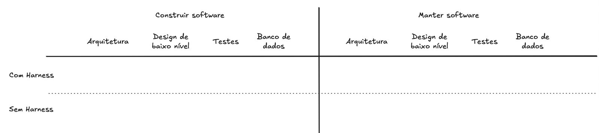

# TCC Lucas — "Harness, pra que te quero?" — discussão de abordagem

Data: 12/09/2026. Discussão entre Rodrigo e Claude, depois da orientação do mesmo dia (ver [2026-09-12-orientacao-lucas.md](2026-09-12-orientacao-lucas.md)).

**Status: proposta em discussão.** Nada aqui está decidido. As decisões pendentes estão na seção 8.

---

## 1. Tema, conforme definido pelo Rodrigo

**Título:** *Harness, pra que te quero?*

**Objetivo:** analisar quanto harness é necessário para que um modelo de linguagem consiga desenvolver software de qualidade.

- As métricas de qualidade ainda precisam ser definidas.
- Neste momento foram definidas as **dimensões** que podem ser trabalhadas.

**Dimensões da matriz:**
- **Atividade:** construir software × manter software.
- **Aspecto:** arquitetura, design de baixo nível (padrões de projeto), testes, banco de dados.
- **Condição:** com harness × sem harness.
- **Modelo:** dimensão adicional. Modelos diferentes podem exigir níveis diferentes de harness para atingir o mesmo objetivo.

**Perguntas de pesquisa de exemplo:**

*Construir do zero × manter software existente*
- É mais importante ter harness na criação de um projeto novo?
- Um projeto existente que precisa ser mantido precisa de harness? Quanto?
- O software e a arquitetura existentes servem de contexto para o modelo?

*Modularidade, testes, banco de dados, arquitetura*
- Quanto harness é necessário para produzir código fácil de manter?
- E para testes de qualidade? Consistência dos dados? Arquitetura adequada?

---

## 2. Sugestão central: harness como dose

"Com × sem harness" responde *se* harness ajuda. O título pergunta *quanto*. Para isso é preciso uma **escada de níveis** que acumulam:

| Nível | O que acrescenta | Tipo |
|---|---|---|
| **N0** | Nada: só a especificação da tarefa | — |
| **N1** | Orientação: convenções e princípios em `CLAUDE.md` / `AGENTS.md` | Instrução (o modelo lê) |
| **N2** | Conhecimento: skills e referências técnicas sob demanda | Instrução |
| **N3** | Verificação automática: build, testes, lint, regras de arquitetura (ArchUnit), hooks | Sensor (retorno objetivo) |
| **N4** | Processo: spec → design → tarefas, revisor e verificador independentes | Processo |

**Métrica que responde o título: harness mínimo suficiente.** Para cada modelo e cada aspecto, qual é o menor nível que atinge um patamar de qualidade definido *antes* do experimento?
Exemplo do tipo de conclusão: "o modelo X atinge testes de qualidade já no N1; o modelo Y só no N3."

**Instrução × verificação.** Um tipo de harness o modelo lê e pode ignorar; o outro devolve retorno objetivo.
Hipótese candidata: modelos mais fracos ganham mais com verificação do que com instrução, e instruções longas podem até atrapalhar.

**Aspectos são o que se mede, não o que se varia.** Arquitetura, design de baixo nível, testes e banco devem ser medidos em **toda** execução. Isso também revela efeitos colaterais: um harness focado em testes pode piorar a arquitetura, por exemplo.

---

## 3. Dimensões adicionais sugeridas

| Dimensão | Por que importa |
|---|---|
| **Modelo**, em 3 níveis (topo, intermediário, pequeno/open-weight) | Só com modelos de topo é provável dar empate (efeito teto, já visto no teste do Lucas). O contraste aparece nos mais fracos |
| **Estado do código existente** (limpo × degradado), só em manutenção | Responde diretamente a "o software existente serve de contexto?". Hipótese: código limpo funciona como harness implícito; código degradado ensina o modelo a errar |
| **Especificidade do harness** (genérico / da stack / do projeto) | Pergunta que o Lucas fez em 12/09. Vira dimensão em vez de decisão |
| **Qualidade do harness** (bem escrito × contraditório ou inchado) | Harness ruim pode ser pior que nenhum |
| **Ambiguidade da especificação** | Parte do papel do harness é suprir o que o pedido não diz. Com spec perfeita, o harness perde função |
| **Agente de execução** (Claude Code, API crua, agente open source) | O agente em si já é um harness. Precisa ser **fixado** |

**Sobre o agente:** para usar vários modelos pelo OpenRouter, o ideal é um único agente open source que aceite qualquer modelo, com configuração idêntica. Candidatos a verificar: OpenHands, Aider, opencode. Assim só o modelo e o harness mudam entre execuções.

---

## 4. Métricas por aspecto

Base em métricas **automáticas**. Rubrica humana cega como complemento, numa amostra avaliada por dois avaliadores, com medida de concordância.

| Aspecto | Métricas objetivas | Observação |
|---|---|---|
| **Corretude** (pré-requisito) | Taxa de aprovação numa **suíte de aceitação oculta**, escrita antes e nunca vista pelo modelo | Exige fixar a interface externa (ex.: contrato HTTP). Sem corretude, as demais notas não valem |
| **Design de baixo nível / manutenibilidade** | Complexidade cognitiva, duplicação, code smells (SonarQube); acoplamento e coesão (métricas CK); **custo de extensão**: arquivos e linhas alterados para aplicar a mesma mudança depois | Custo de extensão é a medida mais honesta de "fácil de manter". Registrar LOC e nº de classes para não confundir excesso de engenharia com qualidade |
| **Testes** | Cobertura de linha e de ramo (JaCoCo); **mutation score** (PIT); **bugs semeados detectados**; test smells | Cobertura sozinha engana. Mutation score separa teste bom de teste enfeite |
| **Banco / consistência de dados** | Regras do domínio aplicadas no banco (FK, unique, not null, check); migrações versionadas; **invariantes violadas** sob testes ocultos, inclusive concorrência e transação | Cenários ocultos, ex.: "dois pedidos simultâneos no mesmo recurso", contando violações |
| **Arquitetura** | Violações de camada e dependência (ArchUnit), ciclos entre pacotes, aderência ao estilo pedido | Regras vêm de uma arquitetura de referência definida antes e oculta ao modelo |
| **Manutenção** (específicas) | Regressões (testes existentes que quebram); mudanças fora do escopo; aderência às convenções do código existente | Mede se o contexto induziu o modelo |
| **Custo** (secundárias) | Tokens (separando os de cache), custo em US$, turnos, tempo, intervenções humanas | Dado complementar, não conclusão principal (conforme orientação de 12/09) |

**"Vale a pena?"** Responder com **qualidade por dólar** e com o **esforço humano de criar e manter o harness**.

---

## 5. Método proposto, em fases

Motivo das fases: a combinação completa explode. 2 atividades × 5 níveis × 3 modelos × 5 repetições = 150 execuções *por tarefa*.

Sugestão: usar o domínio do **Job Manager** como sistema do experimento. É um projeto próprio, o que reduz o risco de o modelo já conhecê-lo do treino.

### Fase A — Construir do zero (foco atual)
- Uma tarefa de porte médio: um recorte do Job Manager com back, front e banco.
- Níveis N0 a N3 × 3 modelos × 5 repetições = **60 execuções**, avaliadas automaticamente. Rubrica humana só em amostra.
- Antes, um piloto com uma execução por combinação.

### Fase B — Manter software existente
- Partir de uma versão de referência do projeto, em duas versões: **limpa** e **degradada**.
- Tarefas idênticas para todos: nova funcionalidade, correção de bug semeado e mudança de esquema do banco.
- Níveis de harness × modelos × estado do código.
- Pergunta-chave: existe uma combinação em que código limpo sem harness empata com código degradado com harness?

### Fase C (opcional) — Retirar componentes
- Partir do harness completo e retirar um componente por vez: sem skills, sem ArchUnit, sem revisor.
- Mostra qual peça carrega o resultado e responde "quanto harness" por componente.

### Análise estatística
- Como os níveis são ordenados, usar o **teste de tendência de Jonckheere-Terpstra**. Ele pergunta se a qualidade sobe com a dose, e encaixa melhor que Mann-Whitney aos pares.
- Tamanho de efeito com **Cliff's delta**.
- Mediana e faixa (mín–máx) por combinação.
- O plano do Lucas (`plano-experimento-harness.md`, 11/09) já cobre boa parte da base: cegamento, rubrica prévia, log de desvios.

### Riscos a tratar desde já
| Risco | Resposta |
|---|---|
| Projeto público presente no treino do modelo | Usar projeto próprio (Job Manager) |
| Harness escrito por IA embutindo requisitos | Revisão humana antes de congelar o harness |
| Avaliador da mesma família do modelo avaliado | Avaliação principal humana ou automática |
| Agente de execução variando entre execuções | Fixar um único agente e uma única configuração |
| Cache distorcendo tempo e tokens | Registrar tokens de cache separadamente; decidir e documentar a política de cache |

---

## 6. Recorte sugerido para caber no TCC

Fechar **2 ou 3 perguntas de pesquisa**:

1. **Dose e aspecto:** quanto harness cada aspecto de qualidade exige para atingir o patamar definido na construção do zero?
2. **Modelo:** esse harness mínimo muda conforme o nível do modelo?
3. **Manutenção:** em manutenção, o código existente substitui parte do harness?

Ficam como trabalho futuro, salvo sobra de tempo: Fase C, qualidade do harness e especificidade do harness.

---

## 7. Hipóteses candidatas (a validar)

- **H-dose:** a qualidade sobe com o nível de harness, mas com retorno decrescente. Existe um ponto de saturação.
- **H-modelo:** o harness mínimo suficiente é maior para modelos menos capazes.
- **H-sensor:** a verificação automática (N3) contribui mais que instrução (N1/N2), sobretudo em modelos fracos.
- **H-contexto:** em manutenção, código existente limpo reduz a necessidade de harness; código degradado aumenta.
- **H-colateral:** harness focado em um aspecto pode piorar outro.
- **H0:** não há diferença observável, porque os modelos já aplicam boas práticas por padrão. É resultado válido e deve estar previsto.

---

## 8. Decisões pendentes

- [ ] Quais modelos entram? Sugestão: um de topo, um intermediário e um open-weight pequeno.
- [ ] Fixar um agente open source e rodar tudo pelo OpenRouter?
- [ ] Usar o domínio do Job Manager como sistema das Fases A e B?
- [ ] Qual o prazo para o Lucas ter resultados e escrever? Isso define se a Fase B entra.
- [ ] Qual o patamar de qualidade ("suficiente") por aspecto, a ser definido antes de rodar?
- [ ] Qual a definição exata de cada nível de harness (N0–N4) e seu congelamento?
- [ ] Harness genérico ou específico do projeto, ou os dois como dimensão?
