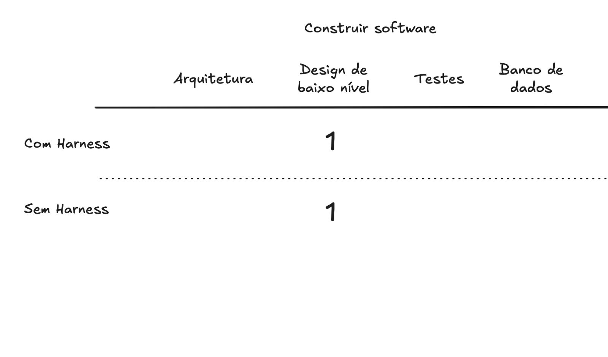

# Orientação — Lucas Felipe — 12/09/2026

Fonte: chat do WhatsApp "Lucas Felipe Ayty Phoebus", mensagens de 12/09/2026, das 15h44 às 16h15.
Contexto anterior: plano de experimento enviado pelo Lucas em 11/09 (`plano-experimento-harness.md`): fatorial 2 × 2, com modelo (Opus, Sonnet) × condição (default, harness), tarefa de criar um serviço do zero.

## 1. O que o Lucas trouxe

Rodou um primeiro teste e pediu à IA um relatório em HTML (artifact no claude.ai).

- **Tarefa:** serviço de notificação de eventos de pedido em Java 21 e Maven, sem framework web e sem banco. Eventos `pedido_criado`, `pedido_pago` e `pedido_cancelado`. Mensagem ao cliente por e-mail, SMS ou push, conforme a preferência do cliente, com texto variando pelo plano (padrão, premium, corporativo). O prompt termina com "decida você mesmo e siga em frente sem perguntar".
- **Harness usado:** só uma linha no `CLAUDE.md`: "Use padrões de projeto sempre que o cenário exigir. Prefira estrutura extensível a condicionais centralizados." Sem skills nem referências.
- **Isolamento:** execução via CLI, sem Claude Code (que ele considera um harness em si), com memory desligado.
- **Execução:** planejou 5 repetições por célula, mas o limite de 5h acabou no meio da 4ª. Analisou até a 3ª.
- **Resultado relatado:**
  - Com harness foi melhor em tudo, nos dois modelos: mais rápido, menos tokens e menos chamadas.
  - Os dois modelos implementaram padrões de projeto nas duas condições, e a versão com harness criou um Observer a mais.
  - A qualidade saiu equivalente "segundo a IA".
  - Custo total aproximado de US$ 30 em um modelo e US$ 12 no outro.
- **Suspeita dele:** o tempo caía a cada repetição, "como se estivesse aprendendo", e ele achou que havia vazamento de informação entre as runs.

## 2. Orientações que passei

### 2.1 Não deixar a IA solta na avaliação
> "Não deixa a IA solta... vai conduzindo caso a caso."

- Fazer um caso, gerar e revisar pessoalmente antes do próximo.
- A qualidade "igual segundo a IA" não serve como evidência. A avaliação precisa passar pela revisão dele (ver rubrica cega do plano, seção 7).

### 2.2 Tokens e tempo: métrica secundária
- A queda de tempo entre repetições é explicada pelo **cache** de prompt, não por aprendizado nem por vazamento de memória.
- Medir custo de token talvez não seja um bom caminho, porque há muitas variáveis envolvidas. Na prática, quem usa vai recorrer a cache e ao que mais reduzir o consumo.
- O Lucas argumentou que vale manter o dado, porque mostra a diferença de custo entre os modelos. **Decisão: manter a coleta e avaliar depois.** Ele vai pesquisar as outras interferências para controlá-las.

### 2.3 A pergunta central é *para que* usar harness
> "O mais importante mesmo é o resultado concreto do que está sendo construído pelo modelo."

Perguntas a responder:
- O harness melhora a qualidade de código? E a de testes? A manutenibilidade? O banco de dados?
- O que influencia e o que não influencia?
- O que o modelo já resolve sozinho e o que precisa ser resolvido por nós?

### 2.4 O espaço de dimensões do trabalho

| Eixo | Valores |
|---|---|
| Atividade | Construir software / Manter software |
| Aspecto avaliado | Arquitetura, Design de baixo nível (= padrões de projeto), Testes, Banco de dados |
| Condição | Com harness / Sem harness |
| Modelo | vários (terceira dimensão) |

Outras dimensões levantadas para pensar:
- **Tamanho do projeto:** um projeto grande e controlado, um pequeno, ou os dois.
- **Construir do zero ou manter algo existente:** o contexto já existente no projeto induz o modelo? Reduz a necessidade do harness? É um bom ponto de análise.
- **Qualidade do próprio harness:** também é uma dimensão. Repensar o harness atual.

### 2.5 Recorte agora: foco

> "Foca aqui agora."

- **Construir do zero × design de baixo nível (padrões de projeto)**, com e sem harness.
- Somar a dimensão **modelo**.
- Manutenção, arquitetura, testes e banco ficam para depois.

### 2.6 Isolamento e variedade de modelos: usar um roteador de LLM
- Sugestão: **OpenRouter**. Pela API o experimento fica mais isolado e dá para testar vários modelos diferentes.
- Correção de entendimento: o Lucas achou que o roteador escolheria o modelo pelo peso da tarefa. Não é esse o uso aqui. A ideia é uma única API para acessar vários modelos, **escolhidos explicitamente** em cada run.

## 3. Pontos de atenção

1. **Resumo do Lucas às 16h03 não coincide com o recorte.** Ele listou três frentes: (1) projeto mais completo com e sem harness, (2) manutenção do projeto grande dele medindo gasto, (3) harness mais completo e realista. Depois disso eu recortei para construir do zero + design de baixo nível + modelo. Confirmar com ele que (2) fica **fora do foco atual** e que o front, back e banco "mais completo" não é o próximo passo.
2. **Pergunta sem resposta:** o harness deve ser genérico ou voltado ao projeto que será construído? Ele acha que o específico fica mais coeso. Precisa de decisão, que se liga à dimensão "qualidade do harness" e à regra do plano de que o harness não pode contrabandear requisito funcional.
3. **Harness de uma linha é fraco demais para concluir algo.** A instrução é muito próxima do próprio pedido, e os dois grupos já usaram padrões. Parece o efeito teto previsto no plano (H0 e risco de empate). Vale repensar o harness antes do experimento valer.
4. **Resposta ambígua no chat:** às 15h51 perguntei se sem `CLAUDE.md` ele gerou com padrão, e ele respondeu "não"; logo depois disse "ambos" e "sim, em todos os casos". Pela sequência, o "não" parece responder a outra coisa, mas convém confirmar se a condição default também aplicou padrões.
5. **Execução interrompida pelo limite de uso:** runs incompletas e sessão via assinatura. Com OpenRouter e API, registrar o custo real e evitar cortes no meio da célula. Registrar o descarte no log de desvios (plano, seção 11).
6. **Cache como variável:** decidir se desliga o cache, se o isola ou se registra os tokens de cache separadamente, e anotar essa decisão na metodologia.

## 4. Próximos passos para o Lucas

- [ ] Estudar o OpenRouter e montar a execução via API com escolha explícita de modelo.
- [ ] Levantar as fontes de interferência (cache, memory, snapshot do modelo, horário) e como controlá-las.
- [ ] Repensar o harness para o recorte "construir do zero + padrões de projeto", respeitando a regra de não acrescentar requisito funcional.
- [ ] Revisar à mão, caso a caso, as saídas da rodada atual, sem delegar o julgamento de qualidade à IA.
- [ ] Manter a coleta de tokens e tempo como dado secundário.
- [ ] Atualizar o `plano-experimento-harness.md` com o novo recorte e a dimensão modelo.
