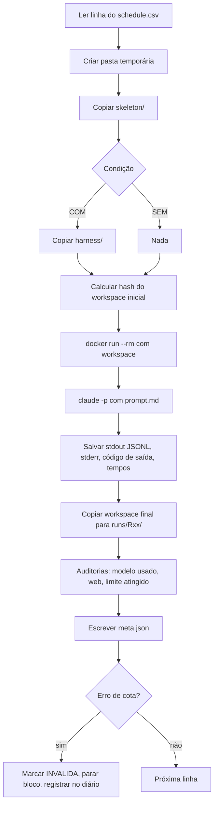
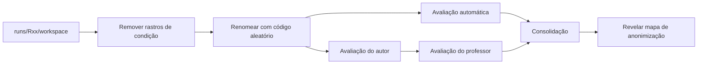

# Plano do experimento: Claude Code com harness × sem harness

> [!abstract] Resumo em uma frase
> Verificar se um **harness configurado** (CLAUDE.md + skill + hook) faz os modelos Claude **reconhecerem e implementarem corretamente o padrão Strategy** ao **construir** uma API Java/Spring Boot, comparado ao **Claude Code puro**, controlando tudo o que não é objeto de estudo.

---

## 0. Como usar este documento

- `- [ ]` são tarefas. Marque conforme for fazendo.
- `> [!question]` são **decisões pendentes**. Resolva antes da fase indicada.
- `> [!warning]` são **pontos de contaminação**. Se ignorados, sujam os dados.
- `> [!check] Validar no piloto` são detalhes técnicos que **precisam ser confirmados** na versão do Claude Code que você fixar (flags, nomes de ferramentas, formato de hooks).

---

## 1. Recorte definido pelo professor

| | Arquitetura | **Design de baixo nível** | Testes | Banco de dados |
|---|---|---|---|---|
| **Construir software**: com harness | – | **1** | – | – |
| **Construir software**: sem harness | – | **1** | – | – |

### 1.1 O que o recorte implica

| Coluna | Situação agora | Consequência prática |
|---|---|---|
| **Design de baixo nível** | ✅ Foco | Padrão **Strategy** é a única coisa avaliada em profundidade |
| Arquitetura | ❌ Fora | Estrutura de camadas **não** é avaliada. O harness **não** traz regras de arquitetura |
| Testes | ❌ Fora | O prompt **não** pede testes. Qualidade de testes **não** é medida |
| Banco de dados | ❌ Fora | **Sem banco.** A API é só cálculo, sem persistência |
| Manter software | ❌ Fora (fase futura) | Só projeto novo |

> [!warning] Harness também respeita o recorte
> Se o CLAUDE.md tiver regras de arquitetura, testes ou banco, o efeito medido mistura várias colunas. O harness fala **somente de design de baixo nível**.

> [!question] Confirmar com o professor: o que significa o "1"?
> - **Interpretação A (assumida neste plano):** 1 tarefa/experimento por célula (Strategy). Mantém as 3 repetições por modelo.
> - **Interpretação B:** 1 execução por célula. Nesse caso, as repetições mudam, e isso afeta a seção 6.

---

## 2. Pergunta de pesquisa e hipóteses

### 2.1 Pergunta principal

> Ao construir uma API nova, um harness focado em design de baixo nível aumenta a taxa de **reconhecimento e implementação correta do padrão Strategy** em modelos Claude, comparado ao Claude Code sem configuração?

### 2.2 Perguntas secundárias

1. Qual o custo do harness em **tokens**, **tempo** e **número de chamadas/turnos**?
2. O efeito do harness é **maior em modelos menores** (Haiku) do que em maiores (Opus)?
3. Um modelo menor **com harness** alcança um modelo maior **sem harness**?

### 2.3 Hipóteses

| ID | Hipótese |
|---|---|
| H1 | Com harness, a proporção de execuções com Strategy correto é maior que sem harness, nos três modelos |
| H2 | Com harness, o consumo de tokens e o tempo são maiores (há skill carregada e hook de verificação) |
| H3 | O ganho do harness é maior no Haiku 4.5 do que no Opus 5 |

> [!note] Natureza do estudo
> Com 3 repetições por combinação, o estudo é **exploratório e descritivo**. Reportar valores individuais, médias e variação. **Não** afirmar significância estatística.

---

## 3. Decisões tomadas

| # | Decisão | Escolha | Justificativa |
|---|---|---|---|
| D1 | Condição "sem harness" | Claude Code **puro** (sem CLAUDE.md, memória, skills, hooks, plugins, MCP) | Isolar o efeito da camada de engenharia de contexto |
| D2 | Condição "com harness" | Claude Code + **CLAUDE.md + skill de Strategy + hook de build** | Cobre regra, conhecimento e verificação |
| D3 | Modo de execução | **Headless** (`claude -p`) | Remove a interferência humana e gera métricas em JSON |
| D4 | Tarefa | **Projeto novo**: API Java + Spring Boot | Recorte "construir software" |
| D5 | Padrão | **Strategy**, **não nomeado** no prompt | Nomear faria o prompt realizar o trabalho do harness |
| D6 | Autenticação | **Assinatura Claude** (login no Claude Code) | Escolha do autor |
| D7 | Modelos | `claude-opus-5`, `claude-sonnet-5`, `claude-haiku-4-5` | Uma faixa de cada |
| D8 | Raciocínio | `--effort high` em todos | Igualdade entre modelos (padrão do Claude Code é `xhigh`) |
| D9 | Isolamento | **Docker, um container novo por execução** | Garantia de ambiente idêntico e descartável |
| D10 | Ferramentas | Ferramentas nativas do Claude Code nas duas condições; **web e subagentes bloqueados** nas duas | Evitar ajuda externa não controlada e troca de modelo |
| D11 | Repetições | **3 por modelo × condição** | Escolha do autor; estudo exploratório |
| D12 | Ordem | **Bloco por modelo**; dentro do bloco, condições **alternadas em ordem sorteada** | Protege contra a cota acabar e mantém com/sem no mesmo período |
| D13 | Ponto de partida | **Esqueleto fixo** (Spring Initializr) | Remove ruído de versões e dependências |
| D14 | Contrato da API | **Fixo no prompt** (endpoints, JSON, erros, arredondamento); design interno livre | Permite a suíte de testes escondida |
| D15 | Testes pelo modelo | **Não pedidos** | Testes estão fora do recorte |
| D16 | Banco de dados | **Nenhum** | Banco está fora do recorte |
| D17 | Maven | **Offline**, dependências pré-baixadas na imagem | Nenhuma dependência nova sem controle |
| D18 | Avaliação | Testes escondidos + rubrica de Strategy **às cegas** + teste de extensão; **autor avalia, depois o professor avalia de forma independente** | Objetividade e confiabilidade entre avaliadores |

---

## 4. Decisões pendentes

> [!question] P1: Domínio da tarefa (resolver antes da Fase 1)
> Proposta usada neste plano: **desconto por tipo de cliente**. Alternativas: frete por modalidade, taxa por meio de pagamento.

> [!question] P2: Versões exatas (resolver antes da Fase 2)
> Java (sugestão: **21 LTS**), Spring Boot (sugestão: a versão estável mais recente no Spring Initializr no dia), Maven, Claude Code.

> [!question] P3: Limites por execução (resolver no piloto)
> Máximo de turnos e tempo máximo. Sugestão: **2× o maior valor observado no piloto**.

> [!question] P4: Significado do "1" na imagem (confirmar com o professor)
> Ver seção 1.1.

> [!question] P5: Conteúdo exato do harness (resolver na Fase 3)
> Texto final do CLAUDE.md e da skill, revisado contra as regras de contaminação.

---

## 5. Variáveis do experimento

### 5.1 Variável independente
- **Harness:** `SEM` (Claude Code puro) × `COM` (Claude Code + harness)

### 5.2 Fator de bloco
- **Modelo:** Opus 5, Sonnet 5, Haiku 4.5

### 5.3 Variáveis controladas (fixas)

| Categoria | O que fica fixo | Como garantir |
|---|---|---|
| Prompt | Texto idêntico nas duas condições | Arquivo `prompt.md` versionado + hash SHA-256 |
| Projeto inicial | Esqueleto idêntico | Pasta `skeleton/` versionada + hash |
| Harness | Arquivos idênticos em todas as execuções `COM` | Pasta `harness/` versionada + hash |
| Claude Code | Mesma versão do início ao fim | Versão fixa na imagem + `DISABLE_AUTOUPDATER=1` |
| Java / Maven / SO | Mesmas versões | Tag fixa da imagem base + hash da imagem |
| Modelo | ID completo, nunca alias | `--model claude-opus-5` etc. |
| Raciocínio | `high` | `--effort high` |
| Ferramentas | Mesmas nas duas condições | `--disallowedTools` igual nas duas |
| Web | Bloqueada | Ferramentas bloqueadas + auditoria de comandos (ver 9.4) |
| Dependências | Nenhuma nova | Maven offline |
| Memória e sessões | Nenhuma | Container novo + sem persistência de sessão |
| Configuração do usuário | Nenhuma | `HOME` limpo dentro do container |
| Troca de modelo | Proibida | Sem `--fallback-model`; subagentes bloqueados; auditoria do uso por modelo |
| Máquina e rede | Mesmas | Rodar sempre no mesmo computador e na mesma rede |

### 5.4 Variáveis dependentes (métricas)

| Métrica | Tipo | Fonte |
|---|---|---|
| **Strategy correto** (sim / parcial / não) | Principal | Rubrica, avaliação às cegas |
| Pontuação da rubrica (0–12) | Principal | Rubrica |
| Testes funcionais escondidos (% aprovados) | Principal | Suíte escondida |
| Teste de extensão (arquivos alterados para um novo tipo) | Principal | Procedimento do avaliador |
| Build compila (sim/não) | Apoio | `mvn -o verify` pós-execução |
| Tokens de entrada, saída e cache | Secundária | JSON do Claude Code |
| Duração total (s) | Secundária | JSON + relógio do script |
| Número de turnos / chamadas de ferramenta | Secundária | JSON / stream de eventos |
| Execução concluída / limite atingido / erro | Controle | Script de execução |

---

## 6. Desenho experimental

### 6.1 Quantidade de execuções

```
3 modelos × 2 condições × 3 repetições = 18 execuções válidas
```

Mais o **piloto** (seção 11), cujas execuções **não** entram na análise.

### 6.2 Ordem de execução

1. Sortear a **ordem dos blocos de modelo** com semente fixa (registrar a semente).
2. Dentro de cada bloco, sortear a ordem das 6 execuções (3 `COM` + 3 `SEM`), **com a restrição de não haver mais de 2 da mesma condição seguidas**.
3. Salvar a ordem em `schedule.csv` **antes** de começar e **não alterar**.

Exemplo de `schedule.csv`:

```csv
ordem,run_id,modelo,condicao,repeticao
1,R01,claude-sonnet-5,COM,1
2,R02,claude-sonnet-5,SEM,1
3,R03,claude-sonnet-5,SEM,2
4,R04,claude-sonnet-5,COM,2
5,R05,claude-sonnet-5,COM,3
6,R06,claude-sonnet-5,SEM,3
7,R07,claude-haiku-4-5,SEM,1
...
```

> [!warning] Cota da assinatura
> Se a cota acabar **no meio** de uma execução, ela é **descartada e refeita do zero** no mesmo lugar da ordem. Nunca continuar uma execução interrompida. Registrar no diário de bordo.

> [!tip] Bloco inteiro de uma vez
> Tente rodar as 6 execuções de um modelo **na mesma janela de tempo** (mesmo dia). Se não couber, divida em pares `COM`+`SEM`, nunca em "todas COM hoje, todas SEM amanhã".

---

## 7. Estrutura de pastas do experimento

```
experimento-harness/
├── README.md                     ← resumo + como reproduzir
├── plano.md                      ← este documento
├── diario-de-bordo.md            ← tudo que aconteceu fora do previsto
├── prompt/
│   └── prompt.md                 ← prompt único, idêntico nas duas condições
├── skeleton/                     ← esqueleto Spring Boot fixo
├── harness/                      ← só é copiado nas execuções COM
│   ├── CLAUDE.md
│   └── .claude/
│       ├── settings.json         ← hook de build
│       ├── hooks/verificar-build.sh
│       └── skills/
│           └── strategy/SKILL.md
├── docker/
│   └── Dockerfile
├── scripts/
│   ├── gerar-ordem.*             ← gera schedule.csv com semente
│   ├── executar.*                ← roda uma linha do schedule
│   ├── executar-bloco.*          ← roda um bloco de modelo
│   ├── anonimizar.*              ← prepara pacotes para avaliação cega
│   └── avaliar-automatico.*      ← build + testes escondidos + extensão
├── avaliacao/
│   ├── testes-escondidos/        ← NUNCA entra no container
│   ├── rubrica-strategy.md
│   ├── mapa-anonimizacao.csv     ← guardado até o fim da avaliação
│   ├── notas-autor.csv
│   ├── notas-professor.csv
│   └── consenso.csv
├── runs/
│   └── R01/
│       ├── meta.json             ← log estruturado da execução
│       ├── claude-output.jsonl   ← saída bruta do Claude Code
│       ├── stderr.txt
│       └── workspace/            ← projeto final gerado
└── analise/
    ├── resultados.csv
    └── graficos/
```

- [ ] Criar repositório Git para `experimento-harness/`
- [ ] Commitar cada artefato congelado com tag (ex.: `v1-congelado`)

---

## 8. Fase 1: Tarefa e prompt

### 8.1 Princípio

> **O que é estudado fica em aberto. Todo o resto fica fixo.**
> Lado de fora (contrato HTTP, regras de negócio, arredondamento, erros) = **fixo**.
> Lado de dentro (classes, pacotes, padrão) = **livre**.

### 8.2 Requisitos do domínio (proposta: desconto por tipo de cliente)

- 3 tipos iniciais com regras **diferentes na forma de calcular**, não só no percentual. Assim um `Map<tipo, percentual>` não resolve tudo e o Strategy fica justificado.
- Frase de negócio indicando **variação futura** ("novos tipos de cliente serão adicionados com frequência"), sem mencionar design.

Exemplo de regras (ajustar em P1):

| Tipo | Regra |
|---|---|
| `COMUM` | Sem desconto |
| `PREMIUM` | 10% de desconto sobre o valor |
| `CORPORATIVO` | 15% de desconto **se valor ≥ R$ 1.000,00**; abaixo disso, 5% |

### 8.3 Contrato da API (fixo)

- **Endpoint:** `POST /descontos/calcular`
- **Request:** `{ "tipoCliente": "PREMIUM", "valor": 200.00 }`
- **Response 200:** `{ "tipoCliente": "PREMIUM", "valorOriginal": 200.00, "desconto": 20.00, "valorFinal": 180.00 }`
- **Arredondamento:** `BigDecimal`, 2 casas, `HALF_EVEN` (**fixar explicitamente**)
- **Erros:**
  - `tipoCliente` inexistente → `400` com `{ "erro": "TIPO_CLIENTE_INVALIDO" }`
  - `valor` ausente, zero ou negativo → `400` com `{ "erro": "VALOR_INVALIDO" }`
- **Limites:** definir explicitamente se é `≥` ou `>` em cada regra.

> [!warning] Ambiguidade vira ruído
> Qualquer ponto do contrato não especificado (arredondamento, formato de erro, nome de campo, limite `≥`/`>`) faz os testes escondidos falharem **por motivo que não é design**. Revise o contrato até não sobrar dúvida.

### 8.4 Palavras proibidas no prompt

Não podem aparecer: `padrão`, `pattern`, `strategy`, `estratégia`, `polimorfismo`, `GoF`, `SOLID`, `aberto/fechado`, `open/closed`, `extensível`, `interface`, `design`, `boas práticas`, `clean code`, `teste`, `testes`.

### 8.5 Esqueleto do `prompt.md`

```markdown
Você está em um projeto Spring Boot já inicializado neste diretório.

## Contexto de negócio
[descrição da empresa e do problema]
Novos tipos de cliente serão adicionados com frequência pelo time comercial.

## Requisito
Implemente o endpoint abaixo.

## Contrato
[endpoint, request, response, erros, arredondamento: exatamente como 8.3]

## Regras de desconto
[tabela 8.2]

## Restrições técnicas
- Não adicione dependências ao pom.xml.
- Não use banco de dados.
- O projeto deve compilar com `mvn -o verify`.

Quando terminar, responda apenas "CONCLUÍDO".
```

### 8.6 Tarefas

- [ ] Resolver **P1** (domínio)
- [ ] Escrever regras de negócio com exemplos numéricos
- [ ] Escrever contrato completo (8.3)
- [ ] Revisar contra a lista de palavras proibidas (8.4)
- [ ] Pedir a outra pessoa para ler e apontar ambiguidades
- [ ] Congelar `prompt.md` e registrar **SHA-256**

---

## 9. Fase 2: Esqueleto e ambiente Docker

### 9.1 Esqueleto do projeto

- [ ] Resolver **P2** (versões)
- [ ] Gerar no Spring Initializr: Maven, Java 21, Spring Boot `<versão>`, dependências **Spring Web** e **Validation** apenas
- [ ] Group/artifact/pacote base fixos (ex.: `br.tcc.descontos`)
- [ ] Remover o teste de exemplo `*ApplicationTests` (testes estão fora do recorte e ele não deve induzir nada)
- [ ] Garantir que **não existe** `CLAUDE.md`, `.claude/`, `README` com instruções ou `HELP.md` com dicas
- [ ] `mvn verify` passa com o esqueleto vazio
- [ ] Congelar `skeleton/` e registrar **hash** (ex.: hash do `.tar` da pasta)

> [!warning] Dependências necessárias para avaliação
> A suíte escondida precisará de `spring-boot-starter-test` (e ArchUnit, se usar). Opções:
> - **(Recomendado)** Deixar esses pacotes **pré-baixados** no `~/.m2` da imagem de avaliação, **não** no esqueleto do modelo.
> - Registrar a escolha no diário.

### 9.2 Dockerfile: requisitos

- [ ] Imagem base JDK com **tag exata** (ex.: `eclipse-temurin:21.0.x_y-jdk`), nunca `latest`
- [ ] Maven com versão exata
- [ ] Node.js com versão exata (requisito do Claude Code)
- [ ] Claude Code instalado com **versão exata** (`npm install -g @anthropic-ai/claude-code@<versão>`)
- [ ] `ENV DISABLE_AUTOUPDATER=1`
- [ ] `ENV CLAUDE_CODE_DISABLE_AUTO_MEMORY=1`
- [ ] Usuário **não-root** com `HOME` vazio (sem `.claude/`, sem `.gitconfig` pessoal)
- [ ] `~/.m2` pré-populado rodando `mvn dependency:go-offline` sobre o esqueleto
- [ ] `settings.xml` do Maven com `<offline>true</offline>`
- [ ] Ferramentas básicas usadas por hooks (`bash`, `jq` se necessário)
- [ ] Build da imagem, registrar **digest/hash** da imagem

### 9.3 Autenticação com a assinatura dentro do container

> [!check] Validar no piloto
> O container precisa usar sua assinatura **sem copiar sua pasta `~/.claude` pessoal** (que contém CLAUDE.md, configurações e memórias).
> Caminho provável: gerar um token de longa duração no host com `claude setup-token` e passá-lo ao container por variável de ambiente (`CLAUDE_CODE_OAUTH_TOKEN`). Confirmar os nomes na versão fixada.

- [ ] Gerar token
- [ ] Guardar token **fora** do repositório (arquivo `.env` no `.gitignore`)
- [ ] Testar `claude -p "responda OK"` dentro do container com `HOME` limpo

> [!warning] Nunca
> - Montar `C:\Users\Lucas\.claude` no container
> - Commitar o token
> - Colocar o token em logs

### 9.4 Rede

Bloquear WebSearch/WebFetch **não impede** o modelo de usar `curl` pelo terminal.

| Opção | Como | Quando escolher |
|---|---|---|
| **A. Proxy com lista de permissão** | Container sem acesso direto à internet; saída só por um proxy que libera domínios da Anthropic | Quer garantia técnica e tem tempo para configurar |
| **B. Auditoria** | Rede normal; após cada execução, procurar `curl`, `wget`, `http://`, `https://` nos comandos executados pelo modelo (no `claude-output.jsonl`) | Prazo curto; aceita marcar e analisar exceções |

- [ ] Escolher A ou B e registrar
- [ ] Se B: script de auditoria + regra ("execução que acessou web externa é marcada e reportada; não é descartada silenciosamente")

---

## 10. Fase 3: Harness

### 10.1 Estrutura

```
harness/
├── CLAUDE.md
└── .claude/
    ├── settings.json
    ├── hooks/verificar-build.sh
    └── skills/strategy/SKILL.md
```

Na condição `COM`, esses arquivos são copiados para a raiz do workspace. Na condição `SEM`, nada é copiado.

### 10.2 CLAUDE.md: diretrizes de conteúdo

Deve conter **apenas design de baixo nível**:
- Identificar pontos onde o **comportamento varia por tipo/categoria** e onde **novas variações são esperadas**
- Preferir padrões GoF adequados a condicionais (`if`/`switch`) por tipo
- Manter cada variação isolada em sua própria classe
- Usar injeção do Spring para registrar variações
- Consultar as skills de padrões quando identificar um caso

Não deve conter:
- ❌ Regras de camadas/arquitetura (fora do recorte)
- ❌ Instruções sobre testes (fora do recorte)
- ❌ Instruções sobre banco (fora do recorte)
- ❌ Qualquer menção ao domínio de **descontos/clientes**

### 10.3 Skill de Strategy: diretrizes de conteúdo

- Quando usar (sinais: comportamento varia por tipo; novas variações esperadas; condicionais repetidas)
- Estrutura em Java/Spring: interface, uma implementação por variação (`@Component`), seleção via `Map`/`List` injetado ou registro centralizado
- Anti-padrões: `switch` por tipo no serviço, estratégia com `if` interno por tipo, estratégia acoplada a HTTP
- Checklist de auto-verificação
- **Exemplo em domínio diferente** (ex.: cálculo de imposto por estado, formatação de relatório por formato)

> [!check] Validar no piloto
> Formato do `SKILL.md` (frontmatter com `name` e `description`) e se a skill é carregada na versão fixada.

### 10.4 Hook de verificação

Objetivo: ao tentar finalizar, rodar `mvn -o -q verify`. Se falhar, devolver o erro ao modelo para corrigir.

- Evento: `Stop`
- Comportamento: build ok → permite terminar; build falhou → bloqueia e envia o erro
- **Proteção contra loop:** permitir no máximo N bloqueios (ex.: 3); depois disso, deixa terminar e registra

> [!check] Validar no piloto
> Formato do `settings.json` para hooks, código de saída que bloqueia a parada e campo que indica que o hook já está ativo, na versão fixada.

### 10.5 Regras de contaminação do harness

> [!warning] O harness NÃO pode
> 1. Conter a solução da tarefa ou exemplo no mesmo domínio
> 2. Conter ou referenciar os testes escondidos
> 3. Conter regras fora do recorte (arquitetura, testes, banco)
> 4. Mudar entre execuções

### 10.6 Tarefas

- [ ] Escrever CLAUDE.md
- [ ] Escrever SKILL.md com exemplo em outro domínio
- [ ] Escrever hook + proteção contra loop
- [ ] Revisar contra 10.5
- [ ] Congelar `harness/` e registrar **hash**

---

## 11. Fase 4: Script de execução

### 11.1 Fluxo de uma execução



### 11.2 Comando do Claude Code (referência)

```bash
claude -p "$(cat /experimento/prompt.md)" \
  --model "$MODELO" \
  --effort high \
  --output-format stream-json --verbose \
  --max-turns "$MAX_TURNOS" \
  --permission-mode bypassPermissions \
  --disallowedTools "WebSearch,WebFetch,Agent" \
  --no-session-persistence
```

Envolvido por `timeout "$TEMPO_MAXIMO"`.

| Flag | Por quê |
|---|---|
| `--model` com ID completo | Snapshot fixo; aliases mudam |
| `--effort high` | Padrão do Claude Code é `xhigh` |
| `stream-json --verbose` | Registra **todos** os eventos: chamadas de ferramenta, comandos, uso por modelo |
| `--max-turns` | Evita loop infinito |
| `bypassPermissions` | Headless sem perguntas; seguro porque o container é descartável |
| `--disallowedTools` | Bloqueia web e subagentes nas duas condições |
| `--no-session-persistence` | Nenhuma sessão reaproveitável |

**Não usar:**
- ❌ `--bare`: desligaria também o harness da condição `COM`
- ❌ `--fallback-model`: troca de modelo
- ❌ `--continue` / `--resume`
- ❌ `--system-prompt`: o prompt de sistema do Claude Code faz parte da base

> [!check] Validar no piloto
> - Nome atual da ferramenta de subagentes (`Agent` ou `Task`) na versão fixada
> - Se `--effort` tem efeito no **Haiku 4.5** (não aceita effort na API); registrar o comportamento observado
> - Se o evento inicial do `stream-json` lista modelo, ferramentas disponíveis, skills, MCP e modo de permissão (usar como **prova de isolamento**)
> - Campos de tokens, duração e turnos no evento final

### 11.3 `meta.json` (log por execução)

```json
{
  "run_id": "R01",
  "ordem": 1,
  "valida": true,
  "motivo_invalidade": null,
  "modelo_solicitado": "claude-sonnet-5",
  "modelos_observados": ["claude-sonnet-5"],
  "condicao": "COM",
  "repeticao": 1,
  "semente_ordem": 20260917,

  "ambiente": {
    "imagem_docker_digest": "sha256:...",
    "claude_code_versao": "x.y.z",
    "java_versao": "21.0.x",
    "maven_versao": "3.9.x",
    "hash_prompt": "sha256:...",
    "hash_skeleton": "sha256:...",
    "hash_harness": "sha256:... | null",
    "commit_experimento": "abc1234",
    "maquina": "PC-Lucas",
    "rede": "casa-wifi"
  },

  "parametros": {
    "effort": "high",
    "max_turnos": 0,
    "tempo_maximo_s": 0,
    "ferramentas_bloqueadas": ["WebSearch", "WebFetch", "Agent"],
    "permission_mode": "bypassPermissions"
  },

  "tempo": {
    "inicio": "2026-09-20T14:02:11-03:00",
    "fim": "2026-09-20T14:19:40-03:00",
    "duracao_s": 1049,
    "duracao_api_s": null
  },

  "resultado_execucao": {
    "codigo_saida": 0,
    "encerramento": "concluido | limite_turnos | timeout | erro | cota",
    "turnos": 0,
    "chamadas_ferramenta": 0,
    "bloqueios_hook": 0
  },

  "tokens": {
    "entrada": 0,
    "saida": 0,
    "cache_leitura": 0,
    "cache_escrita": 0,
    "custo_estimado_usd": 0
  },

  "auditoria": {
    "acesso_web_detectado": false,
    "comandos_suspeitos": [],
    "claude_md_carregado": true,
    "skills_disponiveis": ["strategy"],
    "dependencias_adicionadas": false
  }
}
```

### 11.4 Tarefas

- [ ] `gerar-ordem` com semente fixa → `schedule.csv`
- [ ] `executar` (uma linha)
- [ ] `executar-bloco` (um modelo; para ao detectar erro de cota)
- [ ] Extração automática de métricas do `claude-output.jsonl`
- [ ] Auditorias automáticas (modelo, web, dependências, harness carregado ou não)

---

## 12. Fase 5: Piloto

> [!important] Nada do piloto entra na análise.

### 12.1 Escopo

- **2 modelos** (Haiku 4.5 e Opus 5, os extremos) × **2 condições** × **1 repetição** = 4 execuções
- Usar **o mesmo prompt, esqueleto e harness** do experimento real

### 12.2 Checklist de validação

**Isolamento**
- [ ] Na condição `SEM`, o evento inicial **não** mostra CLAUDE.md, skills, hooks, MCP ou plugins
- [ ] Na condição `COM`, mostra **exatamente** o harness esperado
- [ ] Nenhum vestígio do seu `C:\Users\Lucas\.claude` (CLAUDE.md global, memórias, configurações)
- [ ] Nenhuma sessão salva após a execução

**Parâmetros**
- [ ] Modelo observado = modelo solicitado, **sem uso de outro modelo** em nenhum evento
- [ ] `effort` aplicado (e comportamento no Haiku registrado)
- [ ] WebSearch, WebFetch e subagentes realmente indisponíveis
- [ ] Maven realmente offline

**Harness**
- [ ] Skill foi carregada/consultada na condição `COM`
- [ ] Hook dispara ao finalizar; bloqueia quando o build falha; proteção contra loop funciona

**Coleta**
- [ ] `meta.json` com **todos** os campos preenchidos
- [ ] Workspace final copiado corretamente

**Avaliação**
- [ ] Suíte escondida roda sobre os workspaces do piloto
- [ ] Rubrica aplicável sem ambiguidade (testar nos 4 resultados)

**Operacional**
- [ ] Duração e tokens por execução → definir **P3** (limites)
- [ ] Estimar quantas execuções cabem por janela da assinatura
- [ ] Estimar quantos dias o experimento completo leva

### 12.3 Após o piloto

- [ ] Corrigir problemas encontrados
- [ ] Se mudou prompt/esqueleto/harness: **recongelar** e registrar novos hashes
- [ ] Registrar tudo no diário de bordo
- [ ] Tag `v1-congelado` no Git
- [ ] **A partir daqui, nada muda.**

---

## 13. Fase 6: Execução do experimento

### 13.1 Antes de cada bloco (modelo)

- [ ] Mesmo computador, mesma rede, sem downloads pesados em paralelo
- [ ] Verificar cota da assinatura disponível para as 6 execuções
- [ ] `git status` limpo no repositório do experimento
- [ ] Confirmar hash da imagem Docker

### 13.2 Durante

- [ ] Rodar `executar-bloco` e **não interagir** com as execuções
- [ ] Não usar o Claude Code na mesma conta em paralelo (consome a mesma cota e pode afetar limites)

### 13.3 Regras de exceção

| Situação | Ação |
|---|---|
| Cota acabou no meio | Descartar a execução, refazer **do zero** na mesma posição da ordem, registrar |
| Erro de infraestrutura (Docker, rede local) | Descartar, refazer do zero, registrar |
| Erro da API (5xx, sobrecarga) com execução interrompida | Descartar, refazer do zero, registrar |
| Limite de turnos ou timeout atingido | **Execução válida**, conta como resultado (não repetir) |
| Modelo não entregou nada / build quebrado | **Execução válida**, conta como resultado |
| Acesso web detectado (opção B) | Execução válida, **marcada**, reportada à parte |
| Uso de outro modelo detectado | Investigar; se confirmado, invalidar e rever configuração |

> [!warning] Nunca refazer uma execução porque o resultado foi "ruim"
> Só se refaz por falha de **infraestrutura**, nunca por qualidade.

### 13.4 Diário de bordo (modelo de entrada)

```markdown
### 2026-09-20 14:25, R03
- Situação: cota atingida no turno 14
- Ação: execução descartada; refeita às 19:10 como R03 (tentativa 2)
- Impacto: nenhum na configuração
```

---

## 14. Fase 7: Avaliação

### 14.1 Fluxo



### 14.2 Anonimização

> [!warning] Rastros que revelam a condição
> - `CLAUDE.md`, `.claude/` e o script de hook → **remover** antes de avaliar
> - Logs, `meta.json`, `claude-output.jsonl` → **não entregar** aos avaliadores
> - Comentários no código citando a skill ou o CLAUDE.md → **registrar** como achado, mas não remover (é resultado do modelo); o avaliador anota se viu
> - Datas de modificação dos arquivos → normalizar

- [ ] Script `anonimizar` gera `A7K2/`, `Q9F1/`...
- [ ] `mapa-anonimizacao.csv` guardado **fora** do alcance dos avaliadores até o fim
- [ ] Embaralhar a ordem dos pacotes

### 14.3 Avaliação automática

Para cada pacote:

1. **Build:** `mvn -o verify` → compila? (sim/não)
2. **Testes funcionais escondidos:** copiar `testes-escondidos/` para o projeto e rodar
   - Um caso por tipo de cliente
   - Casos de limite (`valor = 1000.00` no CORPORATIVO, `999.99`)
   - Arredondamento
   - Tipo inválido → 400 + corpo esperado
   - Valor ausente, zero e negativo → 400 + corpo esperado
   - Resultado: `% aprovados`
3. **Métricas de apoio (opcional):** número de classes, presença de `switch`/`if` sobre o tipo (busca estática)

### 14.4 Rubrica de Strategy (avaliação humana)

Cada critério recebe **0 (ausente)**, **1 (parcial)** ou **2 (correto)**.

| # | Critério | 0 | 1 | 2 |
|---|---|---|---|---|
| C1 | **Abstração da variação** | Não há abstração para o cálculo | Abstração existe, mas mistura responsabilidades | Interface/abstração clara representando o cálculo de desconto |
| C2 | **Uma implementação por variação** | Lógica de todos os tipos em um lugar | Algumas variações isoladas, outras não | Cada tipo em sua própria classe |
| C3 | **Contexto sem condicional por tipo** | Serviço/controller com `if`/`switch` por tipo decidindo o cálculo | Condicional reduzida, mas ainda presente fora da seleção | Serviço apenas delega à estratégia |
| C4 | **Seleção da estratégia** | Seleção espalhada ou duplicada | Seleção centralizada, mas com condicional manual por tipo | Seleção sem condicional (ex.: `Map` injetado, registro por anotação/enum) |
| C5 | **Aberto para extensão** | Novo tipo exige alterar várias classes existentes | Novo tipo exige alterar 1 classe existente além de criar a nova | Novo tipo exige **apenas** criar uma classe (e, no máximo, um registro declarativo) |
| C6 | **Coesão das estratégias** | Estratégias acessam HTTP/DTO de request ou fazem validação/erro de API | Pequenos vazamentos de responsabilidade | Estratégias contêm apenas a regra de cálculo |

**Pontuação:** 0 a 12.

**Classificação final (derivada, não opinativa):**

| Classe | Regra |
|---|---|
| ✅ **Strategy correto** | C1, C2, C3 = 2 **e** total ≥ 10 |
| 🟡 **Strategy parcial** | C1 ≥ 1 **e** C2 ≥ 1, sem atingir "correto" |
| ❌ **Sem Strategy** | C1 = 0 **ou** C2 = 0 |

**Campos de observação (não pontuam):**
- Usou outro padrão no lugar? Qual?
- Excesso de engenharia (padrões desnecessários empilhados)?
- Comentários citando regras/skill?

### 14.5 Teste de extensão (procedimento objetivo)

Executado pelo **avaliador** em cada pacote, **depois** da rubrica:

1. Adicionar o tipo `VIP` com regra definida previamente (ex.: 20% de desconto)
2. Fazer a **menor alteração** que funcione
3. Registrar: arquivos **criados**, arquivos existentes **alterados**, linhas alteradas em arquivos existentes
4. Rodar um teste escondido extra para `VIP`

> [!tip] Serve para confirmar o critério C5 com um número, não só com opinião.

### 14.6 Dois avaliadores

1. **Autor avalia** todos os pacotes → `notas-autor.csv` → **commit** (congela antes de ver as notas do professor)
2. **Professor avalia** de forma **independente**, sem acesso às notas do autor → `notas-professor.csv`
3. **Concordância:**
   - Por critério: % de concordância exata
   - Na classificação final: % de concordância e **kappa de Cohen**
4. **Divergências:** discussão entre os dois; decisão final registrada em `consenso.csv` **com justificativa**
5. **Análise** usa `consenso.csv`; a concordância é reportada no TCC

- [ ] Preparar planilha modelo com colunas: `codigo, C1..C6, total, classe, outro_padrao, excesso_engenharia, observacoes`
- [ ] Treino de calibração: avaliar juntos 1–2 pacotes **do piloto** (não do experimento) antes de começar

---

## 15. Fase 8: Análise

### 15.1 Tabela principal (por modelo × condição)

| Modelo | Condição | Strategy correto (x/3) | Rubrica (média ± desvio) | Testes funcionais (média %) | Arquivos alterados no teste de extensão (média) |
|---|---|---|---|---|---|
| Opus 5 | SEM | | | | |
| Opus 5 | COM | | | | |
| Sonnet 5 | SEM | | | | |
| Sonnet 5 | COM | | | | |
| Haiku 4.5 | SEM | | | | |
| Haiku 4.5 | COM | | | | |

### 15.2 Tabela de custo

| Modelo | Condição | Tokens entrada | Tokens saída | Cache leitura | Duração (min) | Turnos | Chamadas de ferramenta | Bloqueios do hook |
|---|---|---|---|---|---|---|---|---|

### 15.3 Análises

- [ ] **Efeito do harness por modelo:** diferença COM − SEM em cada métrica
- [ ] **H1:** o harness aumentou "Strategy correto" nos 3 modelos?
- [ ] **H2:** custo extra do harness (tokens, tempo)
- [ ] **H3:** o efeito é maior no Haiku?
- [ ] **Pergunta 3:** Haiku COM × Opus SEM
- [ ] **Custo-benefício:** tokens por execução com Strategy correto
- [ ] Mostrar **todos os valores individuais** (3 pontos por grupo), não só médias
- [ ] Análise qualitativa: o que os modelos sem harness fizeram no lugar do Strategy?

> [!note] Linguagem dos resultados
> Usar "observou-se", "nas execuções realizadas", "tendência". Evitar "comprova" ou "significativo".

---

## 16. Ameaças à validade

| Tipo | Ameaça | Mitigação |
|---|---|---|
| Interna | Ambiente contaminado (config pessoal, memória) | Docker + HOME limpo + prova pelo evento inicial |
| Interna | Mudança de versão do Claude Code/modelo durante o experimento | Versão fixa, sem atualização automática, janela curta |
| Interna | Variação de carga/horário | Com/sem alternados dentro do bloco |
| Interna | Viés do avaliador | Anonimização + dois avaliadores independentes + rubrica com regras derivadas |
| Interna | Contaminação do harness com a solução | Exemplos da skill em outro domínio; revisão 10.5 |
| Interna | Acesso a web via terminal | Proxy (A) ou auditoria (B) |
| Constructo | Rubrica não captura "Strategy correto" | Critérios baseados na definição do padrão + teste de extensão objetivo |
| Constructo | Pista no prompt ("novos tipos serão adicionados") induz o padrão | É requisito de negócio realista e idêntico nas duas condições; discutir no texto |
| Conclusão | 3 repetições | Estudo exploratório; valores individuais; sem inferência estatística |
| Externa | Um único padrão (Strategy), um domínio, uma linguagem | Declarar escopo; outros padrões/domínios como trabalho futuro |
| Externa | Resultado vale para a versão X do Claude Code e snapshots dos modelos | Registrar versões; declarar |
| Externa | Temperatura não controlável no Claude Code | Declarar; repetições como compensação |
| Externa | Haiku 4.5 não aceita effort | Declarar comportamento observado no piloto |
| Externa | Harness específico (um CLAUDE.md, uma skill, um hook) | Descrever integralmente no apêndice; "quanto harness" como trabalho futuro |

---

## 17. Riscos operacionais

| Risco | Probabilidade | Impacto | Plano |
|---|---|---|---|
| Cota da assinatura insuficiente | Alta | Atraso | Piloto mede consumo; blocos por modelo; regra de refazer do zero |
| Autenticação da assinatura no container não funciona | Média | Bloqueia | Resolver no início da Fase 2; alternativa: API key (mudaria D6, avisar o professor) |
| Hook entra em loop | Média | Execução longa | Proteção de N bloqueios + `--max-turns` + `timeout` |
| Modelo tenta adicionar dependências | Média | Build falha | Maven offline; registrar como resultado |
| Suíte escondida falha por ambiguidade do contrato | Média | Dados inválidos | Revisão do contrato por terceiro; validar no piloto |
| Modelo retirado/alterado | Baixa | Invalida comparação | Janela curta; registrar datas |
| Divergência grande entre avaliadores | Média | Enfraquece resultado | Calibração no piloto; consenso documentado |

---

## 18. Checklist geral em ordem

### Preparação
- [ ] Confirmar com o professor o significado do "1" (P4)
- [ ] Criar repositório `experimento-harness/`
- [ ] Definir domínio (P1)
- [ ] Definir versões (P2)

### Fase 1: Prompt
- [ ] Regras de negócio + exemplos numéricos
- [ ] Contrato completo
- [ ] Revisão de palavras proibidas
- [ ] Revisão por terceiro
- [ ] Congelar + hash

### Fase 2: Esqueleto e Docker
- [ ] Gerar e limpar esqueleto
- [ ] Congelar + hash
- [ ] Dockerfile com versões exatas
- [ ] Maven offline
- [ ] Autenticação da assinatura no container
- [ ] Decidir rede (A ou B)
- [ ] Build da imagem + digest

### Fase 3: Harness
- [ ] CLAUDE.md
- [ ] Skill Strategy (outro domínio)
- [ ] Hook + proteção contra loop
- [ ] Revisão de contaminação
- [ ] Congelar + hash

### Fase 4: Scripts
- [ ] Gerar ordem com semente
- [ ] Executar linha / bloco
- [ ] Extração de métricas
- [ ] Auditorias

### Avaliação (preparar antes de rodar)
- [ ] Testes escondidos
- [ ] Teste extra `VIP`
- [ ] Rubrica final
- [ ] Script de anonimização
- [ ] Planilhas de notas

### Fase 5: Piloto
- [ ] 4 execuções
- [ ] Checklist 12.2 completo
- [ ] Definir limites (P3)
- [ ] Calibração dos avaliadores
- [ ] Recongelar + tag `v1-congelado`

### Fase 6: Execução
- [ ] Bloco modelo 1
- [ ] Bloco modelo 2
- [ ] Bloco modelo 3
- [ ] Diário de bordo atualizado

### Fase 7: Avaliação
- [ ] Anonimizar
- [ ] Avaliação automática
- [ ] Avaliação do autor + commit
- [ ] Avaliação do professor
- [ ] Concordância + consenso

### Fase 8: Análise e escrita
- [ ] Tabelas 15.1 e 15.2
- [ ] Hipóteses H1–H3
- [ ] Análise qualitativa
- [ ] Ameaças à validade
- [ ] Apêndice: prompt, harness completo, rubrica, versões e hashes

---

## 19. Trabalhos futuros (fora do recorte atual)

- Colunas **Arquitetura**, **Testes** e **Banco de dados**
- Linha **Manter software** (usar as APIs geradas como base)
- Outros padrões (Factory, Observer, Decorator...)
- **Níveis de harness** (só CLAUDE.md → + skill → + hook → + revisor) para responder "quanto harness é necessário"
- Mais repetições para inferência estatística
