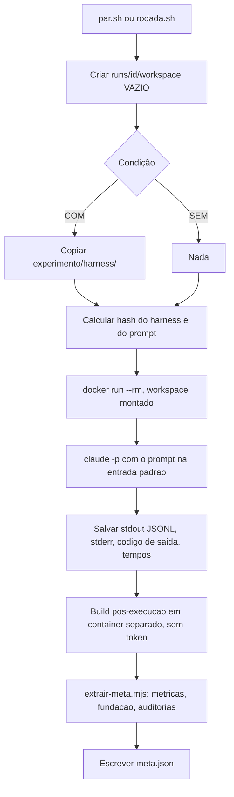
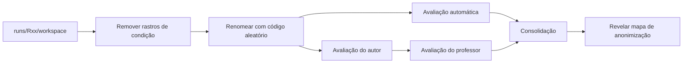

# Plano do experimento: Claude Code com harness × sem harness

> [!abstract] Resumo em uma frase
> Verificar se um **harness configurado** (`CLAUDE.md`) faz os modelos Claude **reconhecerem e implementarem corretamente o padrão Strategy** em **três pontos de dificuldade crescente** (fácil, média, difícil) ao **construir** uma API Java/Spring Boot de checkout, comparado ao **Claude Code de fábrica**, controlando tudo o que não é objeto de estudo.

> [!info] Arquivos relacionados
> - `experimento/prompt/prompt.md`: o enunciado enviado ao modelo
> - `avaliacao/gabarito-avaliador.md`: localização dos pontos de Strategy, soluções esperadas e casos reservados (**confidencial**, nunca entra no container)
> - `docs/harness-notas.md`: o harness, as fontes de cada regra e o diário de versões do enunciado
> - `docs/o-que-falta.md`: o que ainda bloqueia o lote

---

## 0. Como usar este documento

> [!info] Revisão de 20/09/2026
> Este documento estava descrevendo uma bancada que não existe mais. Foram
> alinhados à realidade: D1, D10, D13, 5.3, 6.2, 7, 9.1, 9.2, 9.4, 10.1, 11.1,
> 11.2, 11.3, 11.4, 12, 13.2, 14.3, 16 e 18.
>
> Quatro decisões foram fechadas no mesmo dia, depois do alinhamento: a redação
> da H2 (2.4), o `effort` do D8 (3.1), as regras de aceitação da rubrica (14.4a)
> e o paralelismo (6.2 e 13.2).
> 
> **Continua em aberto:** o campo `repeticao` no `meta.json`, o procedimento do
> campo `valida`, e o que fazer quando o agente desobedecer as versões pedidas
> no enunciado.

- `- [ ]` são tarefas. Marque conforme for fazendo.
- `> [!question]` são **decisões pendentes**. Resolva antes da fase indicada.
- `> [!warning]` são **pontos de contaminação**. Se ignorados, sujam os dados.
- `> [!check] Validar no piloto` são detalhes técnicos que **precisam ser confirmados** na versão do Claude Code que você fixar (flags, nomes de ferramentas, formato de hooks).

---

## 1. Recorte definido pelo professor

| | Arquitetura | **Design de baixo nível** | Testes | Banco de dados |
|---|---|---|---|---|
| **Construir software**: com harness | – | **1** | – | – |
| **Construir software**: sem harness | – | **1** | – | – |

### 1.1 O que o recorte implica

| Coluna | Situação agora | Consequência prática |
|---|---|---|
| **Design de baixo nível** | ✅ Foco | Padrão **Strategy** é a única coisa avaliada em profundidade, em 3 pontos do mesmo serviço |
| Arquitetura | ❌ Fora | Estrutura de camadas **não** é avaliada. O harness **não** traz regras de arquitetura |
| Testes | ❌ Fora | O prompt **não** pede testes. Qualidade de testes **não** é medida |
| Banco de dados | ❌ Fora | **Sem banco.** A API é só cálculo; cupons ficam fixos no código |
| Manter software | ❌ Fora (fase futura) | Só projeto novo |

> [!warning] Harness também respeita o recorte
> Se o CLAUDE.md tiver regras de arquitetura, testes ou banco, o efeito medido mistura várias colunas. O harness fala **somente de design de baixo nível**.

> [!question] Confirmar com o professor: o que significa o "1"?
> - **Interpretação A (assumida neste plano):** 1 tarefa/experimento por célula (Strategy). Mantém as 3 repetições por modelo.
> - **Interpretação B:** 1 execução por célula. Nesse caso, as repetições mudam, e isso afeta a seção 6.

---

## 2. Pergunta de pesquisa e hipóteses

### 2.1 Pergunta principal

> Ao construir uma API nova, um harness focado em design de baixo nível aumenta a taxa de **reconhecimento e implementação correta do padrão Strategy** em modelos Claude, comparado ao Claude Code sem configuração? Esse efeito muda conforme a **dificuldade de perceber** onde o padrão é necessário?

### 2.2 Perguntas secundárias

1. Qual o custo do harness em **tokens**, **tempo** e **número de chamadas/turnos**?
2. O efeito do harness é **maior em modelos menores** (Haiku) do que em maiores (Opus)?
3. Um modelo menor **com harness** alcança um modelo maior **sem harness**?
4. O efeito do harness **cresce com a dificuldade** do ponto (fácil → média → difícil)?

### 2.3 Pontos de Strategy na tarefa

| Ponto | Domínio no prompt | Dificuldade | Por quê |
|---|---|---|---|
| **P1** | Entrega | 🟢 Fácil | Tabela única + frase explícita de novas opções |
| **P2** | Cupons | 🟡 Média | Variações como exemplos concretos; pista fraca de mudança |
| **P3** | Pagamento | 🔴 Difícil | Regras espalhadas em 3 seções; nenhuma pista de mudança |

Detalhes, soluções esperadas e sinais de ausência: `gabarito-avaliador.md`.

### 2.4 Hipóteses

| ID | Hipótese |
|---|---|
| H1 | Com harness, a proporção de pontos com Strategy correto é maior que sem harness, nos três modelos |
| H2 | O harness **altera** o consumo de tokens e o tempo. Sem direção declarada. Redigida assim em 20/09/2026, ver abaixo |
| H3 | O ganho do harness é maior no Haiku 4.5 do que no Opus 5 |
| H4 | Nas duas condições, a taxa de acerto cai com a dificuldade (P1 > P2 > P3) |
| H5 | O ganho do harness é maior em P2 e P3 do que em P1 (onde o modelo puro já tende a acertar) |

> [!note] Por que a H2 é não-direcional
> Resolvido em 20/09/2026. A redação anterior dizia "são **maiores**", e
> justificava com "há skill carregada e hook de verificação". Os dois saíram do
> harness em 19/09: hoje ele é só texto, de 0,6% a 1,1% da entrada total.
>
> E a direção está contradita pelas execuções de medição. Com esqueleto, tokens
> de entrada somados, `SEM` contra `COM`: Opus 874.604 → 507.169 (−42%), Sonnet
> 2.056.553 → 1.134.373 (−45%), Haiku misto. É n=1 em Opus e Sonnet, então não
> prova a direção contrária — mas pré-registrar "maiores" seria pré-registrar
> uma hipótese que a própria medição já contraria.
>
> **Mecanismo plausível, declarado e não assumido:** o harness reduz retrabalho,
> e retrabalho custa turno. As runs de 19/09 mostram o Haiku quebrando o build
> de 4 a 6 vezes por execução, quase tudo compilação, contra zero do Opus com
> harness. A análise reporta a direção observada; a hipótese não a assume.

> [!note] Natureza do estudo
> Com 3 repetições por combinação, o estudo é **exploratório e descritivo**. Reportar valores individuais, médias e variação. **Não** afirmar significância estatística.

---

## 3. Decisões tomadas

| # | Decisão | Escolha | Justificativa |
|---|---|---|---|
| D1 | Condição "sem harness" | Claude Code **como vem de fábrica**: sem `CLAUDE.md`, sem auto memory, e sem skill, hook, plugin ou MCP **do projeto**. As skills e os slash commands embutidos no CLI continuam disponíveis, nas duas condições | Isolar o efeito da camada que o autor acrescenta. O braço não é um ambiente vazio: a FUMACA-01 registrou 18 skills embutidas, 51 slash commands e 5 agents com `~/.claude` vazio |
| D2 | Condição "com harness" | Claude Code + **`CLAUDE.md`**, com quatro regras de projeto em tom geral. Sem skill (ver 10.3). Hook adiado até medir o custo por edição | O harness é integralmente advisory, e a taxa de cumprimento passa a fazer parte do que se mede |
| D3 | Modo de execução | **Headless** (`claude -p`) | Remove a interferência humana e gera métricas em JSON |
| D4 | Tarefa | **Projeto novo**: API Java + Spring Boot de **resumo de checkout** de loja online | Recorte "construir software"; domínio realista com várias regras que variam |
| D5 | Padrão | **Strategy**, **não nomeado** no prompt | Nomear faria o prompt realizar o trabalho do harness |
| D5a | Voz do prompt | **Dono de loja que não programa**, focado em funcionalidades | Nenhuma orientação de código; o modelo decide o design |
| D5b | Pontos de Strategy | **3 pontos**: entrega (fácil), cupons (média), pagamento (difícil) | Permite analisar o efeito do harness por dificuldade |
| D6 | Autenticação | **Assinatura Claude** (login no Claude Code) | Escolha do autor |
| D7 | Modelos | `claude-opus-5`, `claude-sonnet-5`, `claude-haiku-4-5` | Uma faixa de cada |
| D8 | Raciocínio | `--effort medium` em todos | Revisto em 20/09/2026. Igualdade entre modelos continua sendo o ponto (o padrão do Claude Code é `xhigh`), mas o nível passa de `high` para `medium`. Ver 3.1 |
| D9 | Isolamento | **Docker, um container novo por execução** | Garantia de ambiente idêntico e descartável |
| D10 | Ferramentas | Ferramentas nativas do Claude Code nas duas condições. **Web liberada** nas duas, revisto em 20/09/2026. **Subagentes bloqueados** nas duas | Web: validade externa — quem usa o Claude Code no dia a dia tem web. Subagente: impedir troca de modelo. O custo da liberação está em 16 e no diário |
| D11 | Repetições | **3 por modelo × condição** | Escolha do autor; estudo exploratório |
| D12 | Ordem | **Bloco por modelo**; dentro do bloco, condições **alternadas em ordem sorteada** | Protege contra a cota acabar e mantém com/sem no mesmo período |
| D13 | Ponto de partida | **Pasta vazia.** Java 21 e Spring Boot 4.1.1 são **pedidos no enunciado**, em "Observações do time técnico" | Revisto em 20/09/2026. O esqueleto do Spring Initializr trazia `CheckoutApplication.java`, e um pacote raiz imposto já é decisão de estrutura. Virou pedido, não garantia: a obediência é dado, em `fundacao.spring_boot` e `fundacao.java` |
| D14 | Contrato da API | **Fixo no anexo do prompt** ("combinado com o desenvolvedor do site"): endpoint, JSON, erros com precedência, arredondamento; design interno livre | Permite a suíte de testes escondida sem quebrar a voz de não-programador no restante |
| D15 | Testes pelo modelo | **Não pedidos** | Testes estão fora do recorte |
| D16 | Banco de dados | **Nenhum** | Banco está fora do recorte |
| D17 | Maven | **Online**. O agente pode acrescentar dependência se julgar necessário; o `~/.m2` vem aquecido só para o tempo de download não entrar na medição | Revisto em 19/09/2026. A pinagem de versão já vem do `spring-boot-starter-parent`, então o offline não protegia contra deriva: protegia contra dependência nova, e isso virou **registro** em `meta.json.dependencias` no lugar de proibição |
| D18 | Avaliação | Testes escondidos + rubrica de Strategy **por ponto (P1, P2, P3)**, **às cegas** + teste de extensão **por ponto**; **autor avalia, depois o professor avalia de forma independente** | Objetividade e confiabilidade entre avaliadores |

### 3.1 Por que o D8 passou de `high` para `medium`

Resolvido em 20/09/2026. A decisão original era `high`; **22 das 24 execuções de
medição saíram em `medium`**, e as duas únicas em `high` são as FUMACA, que estão
declaradamente fora da análise.

Dois motivos, nenhum deles olhando desfecho:

1. **Toda a calibração de custo vale para `medium`.** A estimativa de "~8% da
   janela de cinco horas por rodada de seis" foi medida em `medium`. Em `high`
   ela precisaria ser refeita do zero.
2. **`medium` compra mais repetições.** Com orçamento de cota fixo, `n` é a
   dimensão mais fraca do estudo — 3 por célula, exploratório, sem inferência.
   Trocar profundidade de raciocínio por `n` melhora mais o trabalho.

> [!important] Isso não é escolher depois de ver o resultado
> A justificativa é **medição de custo**, não de desfecho: nenhuma rubrica foi
> aplicada, nenhum ponto de Strategy foi pontuado. Mudar parâmetro por custo
> antes do lote é legítimo; mudar por resultado não seria. A distinção precisa
> estar no pré-registro, porque é ela que separa os dois casos.

> [!check] Continua por validar no piloto
> Se `--effort` tem efeito no **Haiku 4.5**. O `meta.json` registra
> `tokens.raciocinio`, mas sem um A/B proposital não dá para dizer se o nível
> mudou alguma coisa nesse modelo.

---

## 4. Decisões pendentes

> [!success] P1: Domínio da tarefa (resolvido)
> **Resumo de checkout** com três pontos de Strategy: entrega, cupons e pagamento. Ver `experimento/prompt/prompt.md`.

> [!success] P6: Regras de aceitação na rubrica (resolvido em 20/09/2026)
> As três respostas estão em 14.4a, ancoradas nas formas que aparecem de fato
> nas execuções de medição.

> [!success] P2: Versões exatas (resolvido)
> Fixadas na imagem: base `maven:3.9.16-eclipse-temurin-21`, Node `24.19.0`,
> Claude Code `2.1.269`. Java 21 e Spring Boot 4.1.1 são **pedidos no enunciado**
> desde 20/09/2026 e aquecidos no `~/.m2`; ver D13 e 9.1.

> [!success] P3: Limites por execução (resolvido)
> **Não há limite automático.** Sem `timeout` e sem `--max-turns`: a execução
> corre até o fim, e interromper à mão é julgamento registrado, com o risco de
> viés descrito em 13.3.

> [!question] P4: Significado do "1" na imagem (confirmar com o professor)
> Ver seção 1.1.

> [!success] P5: Conteúdo exato do harness (resolvido)
> `experimento/harness/CLAUDE.md`, quatro regras, 14 linhas, hash
> `56057792…ea24b882`. Sem skill e sem hook, ver 10.3 e 10.4. A fonte de cada
> regra e o diário de versões estão em `docs/harness-notas.md`.

> [!success] P7: Desobediência às versões pedidas (resolvido em 20/09/2026)
> **Taxa reportada.** A execução continua válida e a desobediência vira dado,
> em `fundacao.obedeceu_versoes`, reportado por modelo e condição.
>
> É consistente com a §13.3, que já conta build quebrado como resultado válido
> — e o `MED-06` mostrou o caso extremo, com o Haiku escolhendo Java 11 sob
> Spring Boot 3.x, que nem compila. Excluir apagaria o dado; covariável não tem
> poder com n=3.

---

## 5. Variáveis do experimento

### 5.1 Variável independente
- **Harness:** `SEM` (Claude Code puro) × `COM` (Claude Code + harness)

### 5.2 Fator de bloco
- **Modelo:** Opus 5, Sonnet 5, Haiku 4.5

### 5.3 Variáveis controladas (fixas)

| Categoria | O que fica fixo | Como garantir |
|---|---|---|
| Prompt | Texto idêntico nas duas condições | Arquivo `prompt.md` versionado + hash SHA-256 |
| Projeto inicial | **Pasta vazia** nas duas condições | O `executar.sh` cria o workspace vazio; o `~/.m2` da imagem é aquecido nas versões que o enunciado pede |
| Harness | Arquivos idênticos em todas as execuções `COM` | Pasta `harness/` versionada + hash |
| Claude Code | Mesma versão do início ao fim | Versão fixa na imagem + `DISABLE_AUTOUPDATER=1` |
| Java / Maven / SO | Mesmas versões | Tag fixa da imagem base + hash da imagem |
| Modelo | ID completo, nunca alias | `--model claude-opus-5` etc. |
| Raciocínio | `high` | `--effort high` |
| Ferramentas | Mesmas nas duas condições | `--disallowedTools "Agent,Task"` igual nas duas |
| Web | **Liberada** nas duas condições | Idêntica nos dois braços. O uso é registrado, não impedido: `chamadas_por_ferramenta` e `auditoria.comandos_suspeitos` no `meta.json` |
| Dependências | Livres, e registradas | Sem pom de partida, `meta.json.dependencias.acrescentadas` passa a ser a lista inteira do que o agente declarou |
| Memória e sessões | Nenhuma | Container novo + sem persistência de sessão |
| Configuração do usuário | Nenhuma | `HOME` limpo dentro do container |
| Troca de modelo | Proibida | Sem `--fallback-model`; subagentes bloqueados; auditoria do uso por modelo |
| Máquina e rede | Mesmas | Rodar sempre no mesmo computador e na mesma rede |

### 5.4 Variáveis dependentes (métricas)

| Métrica | Tipo | Fonte |
|---|---|---|
| **Strategy correto** (sim / parcial / não) **em P1, P2 e P3** | Principal | Rubrica por ponto, avaliação às cegas |
| Pontuação da rubrica (0–12) **por ponto** | Principal | Rubrica |
| Pontos com Strategy correto por execução (0–3) | Principal | Derivada da rubrica |
| Testes funcionais escondidos (% aprovados, total e por área: entrega, cupons, pagamento, erros) | Principal | Suíte escondida |
| Teste de extensão **por ponto** (arquivos criados/alterados) | Principal | Procedimento do avaliador |
| Build compila (sim/não) | Apoio | `mvn verify` pós-execução, em container separado sem token |
| Tokens de entrada, saída e cache | Secundária | JSON do Claude Code |
| Duração total (s) | Secundária | JSON + relógio do script |
| Número de turnos / chamadas de ferramenta | Secundária | JSON / stream de eventos |
| Execução concluída / limite atingido / erro | Controle | `resultado_execucao.encerramento` |
| `valida` | Controle | **Humano**, pela tabela de 13.3. O extrator propõe em `valida_proposta` |
| Obediência às versões pedidas | Controle | `fundacao.obedeceu_versoes` (P7) |

---

## 6. Desenho experimental

### 6.1 Quantidade de execuções

```
3 modelos × 2 condições × 3 repetições = 18 execuções válidas
```

Mais o **piloto** (seção 11), cujas execuções **não** entram na análise.

### 6.2 Ordem de execução

Revisto em 19/09/2026. A ordem sorteada com `schedule.csv` foi **abandonada** em
favor de rodar `SEM` e `COM` **ao mesmo tempo**, no mesmo par. Sortear a ordem
protege contra o efeito de horário e carga de servidor; rodar simultâneo
**elimina** esse efeito em vez de distribuí-lo, o que é melhor.

- `infra/scripts/par.sh <prefixo> <modelo>` roda o par `SEM` e `COM` juntos.
- `infra/scripts/rodada.sh <prefixo>` roda os três modelos nas duas condições,
  seis execuções em paralelo.

> [!success] A contradição com o 13.2 foi resolvida em 20/09/2026
> O paralelismo fica, e o 13.2 foi reescrito. O custo declarado está lá e em 16.

> [!warning] Falta `repeticao` no dado
> O id da run codifica prefixo, modelo e condição, e o `meta.json` não grava qual
> repetição é cada uma. Com n=3 por célula isso precisa existir antes do lote.

> [!warning] Cota da assinatura
> Se a cota acabar **no meio** de uma execução, ela é **descartada e refeita do zero** no mesmo lugar da ordem. Nunca continuar uma execução interrompida. Registrar no diário de bordo.

> [!tip] Bloco inteiro de uma vez
> Tente rodar as 6 execuções de um modelo **na mesma janela de tempo** (mesmo dia). Se não couber, divida em pares `COM`+`SEM`, nunca em "todas COM hoje, todas SEM amanhã".

---

## 7. Estrutura de pastas do experimento

A divisão é por **quem enxerga o quê**. Reescrita em 20/09/2026: a estrutura
anterior, com `prompt/`, `skeleton/`, `docker/`, `scripts/` e `analise/` soltos
na raiz, nunca existiu no disco.

```
experimento/     copiado para dentro do workspace do agente
  prompt/        prompt.md, o enunciado, idêntico nas duas condições
  harness/       só na condição COM. Hoje: CLAUDE.md

infra/           roda de fora, o agente nunca vê
  docker/        Dockerfile fixado por versão + projeto de aquecimento do ~/.m2
  scripts/       executar.sh, par.sh, rodada.sh, extrair-meta.mjs

avaliacao/       NUNCA chega ao agente
  gabarito-avaliador.md    onde estão P1, P2 e P3 e o que se espera
  rotas-descobertas.md     o que os exemplos do enunciado não cobrem
  casos/                   casos entrada->saida, em JSON
  ferramentas/             comparar.mjs, conferir-exemplos.sh, autoteste.mjs

docs/            plano.md, harness-notas.md, o-que-falta.md
runs/<id>/       workspace/, claude-output.jsonl, stderr.txt, build.txt, meta.json
runs/logs/       saída de terminal de cada execução
```

> [!warning] `experimento/harness/` é copiado inteiro
> `cp -r experimento/harness/. workspace/`. Qualquer arquivo largado ali chega
> ao agente. Anotação vai em `docs/harness-notas.md`, nunca ali dentro.

O workspace do agente **nasce vazio**. O `.dockerignore` é lista branca: só
`infra/docker/` entra no contexto de build da imagem.

### 7.1 O que ainda não existe

| item | de quem é exigido |
|---|---|
| `docs/diario-de-bordo.md` | 13.3 manda registrar toda exceção nele, 13.4 define o formato, 12.3 e 17 dependem dele. Hoje o conteúdo mora dentro de `harness-notas.md`, como "Diário de decisões da bancada" |
| `avaliacao/rubrica-strategy.md` | 14.4 define a escala; falta o instrumento com âncoras, ver A1 de `o-que-falta.md` |
| `avaliacao/testes-extensao/` | 14.5 |
| `avaliacao/mapa-anonimizacao.csv` e as planilhas de notas | 14.2 e 14.6 |
| agregador `meta.json` -> CSV, e a análise | 15 |

- [x] Criar repositório Git — feito em 20/09/2026
- [ ] Commitar cada artefato congelado com tag (ex.: `v1-congelado`)

---

## 8. Fase 1: Tarefa e prompt

### 8.1 Princípio

> **O que é estudado fica em aberto. Todo o resto fica fixo.**
> Lado de fora (contrato HTTP, regras de negócio, arredondamento, erros) = **fixo**.
> Lado de dentro (classes, pacotes, padrão) = **livre**.

### 8.2 Domínio: resumo de checkout de loja online

O prompt é escrito na voz de um **dono de loja que não programa**, descrevendo só funcionalidades. O serviço calcula o resumo da compra na ordem:

1. Subtotal dos produtos
2. Desconto do cupom
3. Frete
4. Total do pedido = produtos − cupom + frete
5. Ajuste da forma de pagamento

### 8.3 Os três pontos de Strategy

| Ponto | Variações no prompt | Comportamentos que variam | Como a dificuldade foi construída |
|---|---|---|---|
| 🟢 **P1: Entrega** | `ECONOMICA`, `EXPRESSA`, `RETIRADA_LOJA`, `MOTOBOY` | Custo, prazo, disponibilidade (motoboy ≤ 5 kg) | Tabela única + *"quase toda semana entra uma opção nova de entrega, cada uma com seu jeito de cobrar, seu prazo e suas limitações"* |
| 🟡 **P2: Cupons** | `BEMVINDO10`, `MENOS50`, `FRETEGRATIS`, `LEVE3PAGUE2` | Condição de aplicação, cálculo do desconto (sobre produtos, frete ou itens) | Lista de **cupons concretos**, não de "tipos de regra"; pista fraca: *"o pessoal do marketing adora inventar promoção"* |
| 🔴 **P3: Pagamento** | `PIX`, `CARTAO`, `BOLETO` | Ajuste do total, parcelas permitidas, cálculo da parcela (Price), disponibilidade | Regras **espalhadas** entre FAQ do atendimento, observações do financeiro e tabela de erros; misturadas com itens irrelevantes; **nenhuma** pista de novas formas |

> [!note] Por que P3 ainda justifica Strategy sem pista de mudança
> Cada forma de pagamento tem **quatro comportamentos** diferentes. Com condicionais, a mesma decisão por forma de pagamento se repete em vários pontos do código.

### 8.4 Contrato da API (anexo do prompt)

Fica num anexo apresentado como **"combinado com o desenvolvedor do site"**, para não quebrar a voz de não-programador no restante.

- **Endpoint:** `POST /checkout/resumo`
- **Request:** `itens[]` (`nome`, `precoUnitario`, `quantidade`, `pesoKg`), `modalidadeEntrega`, `cupom` (opcional), `formaPagamento`, `parcelas` (opcional, padrão 1)
- **Response 200:** `subtotalProdutos`, `descontoCupom`, `frete`, `prazoEntregaDias`, `ajustePagamento`, `totalFinal`, `parcelas`, `valorParcela`
- **Arredondamento:** centavos, "meio para o par", em cada etapa
- **Erros 400:** `{ "erro": "CODIGO" }` com **ordem de precedência** fixa de 8 códigos
- **4 exemplos resolvidos** no prompt; outros casos ficam reservados para a suíte escondida (ver gabarito)

> [!warning] Ambiguidade vira ruído
> Qualquer ponto não especificado (arredondamento, formato de erro, nome de campo, limite `≥`/`>`, precedência de erros) faz os testes escondidos falharem **por motivo que não é design**.

Limites definidos explicitamente no prompt:

| Regra | Limite |
|---|---|
| Motoboy | até 5 kg (inclusive) |
| MENOS50 | a partir de R$ 300,00 em produtos (inclusive) |
| Boleto indisponível | total do pedido **acima** de R$ 1.000,00 |
| Cartão sem juros | 1× a 3× |
| Cartão com juros | 4× a 12×, 1,99% a.m., tabela Price |
| FRETEGRATIS | `descontoCupom` = valor do frete; `frete` aparece normalmente |
| LEVE3PAGUE2 | a cada 3 unidades **do mesmo item do carrinho**, 1 grátis |

### 8.5 Palavras proibidas no prompt

Não podem aparecer: `padrão`, `pattern`, `strategy`, `estratégia`, `polimorfismo`, `GoF`, `SOLID`, `aberto/fechado`, `open/closed`, `extensível`, `interface`, `design`, `boas práticas`, `clean code`, `teste`, `testes`.

> [!check] Verificação feita
> Busca por essas palavras no `experimento/prompt/prompt.md`: **nenhuma ocorrência**. Repetir a busca a cada alteração do prompt.

> [!tip] Cuidado com "padrão" no sentido de "valor padrão"
> No prompt, usar "se não vier, considerar 1" em vez de "por padrão 1".

### 8.6 Valores conferidos

Todos os exemplos do prompt e os casos reservados do gabarito foram recalculados com `BigDecimal`/`decimal` e arredondamento "meio para o par".

| Exemplo | Resultado |
|---|---|
| 1: EXPRESSA + BEMVINDO10 + PIX | total final 381,74 |
| 2: ECONOMICA + CARTAO 6× | 6× de 75,90 = 455,40 |
| 3: MOTOBOY + MENOS50 + BOLETO | total final 371,29 |
| 4: RETIRADA_LOJA + LEVE3PAGUE2 + CARTAO 3× | 3× de 86,43; total 259,30 |
| E5 (reservado): EXPRESSA + FRETEGRATIS + PIX | Pix 2,995 → 3,00; total 56,90 |
| E6 (reservado): MOTOBOY + MENOS50 + CARTAO 12× | 12× de 34,76 = 417,12 |

### 8.7 Tarefas

- [x] Definir domínio (P1)
- [x] Escrever regras de negócio com exemplos numéricos
- [x] Escrever contrato completo
- [x] Revisar contra a lista de palavras proibidas
- [ ] Recalcular os exemplos de forma independente (planilha ou código próprio)
- [ ] Pedir a outra pessoa para ler e apontar ambiguidades
- [ ] Validar no piloto se algum teste escondido falha por ambiguidade do contrato
- [ ] Congelar `prompt.md` e registrar **SHA-256**

---

## 9. Fase 2: Ambiente Docker

### 9.1 Ponto de partida: pasta vazia

Revisto em 20/09/2026. O esqueleto do Spring Initializr foi **removido**.

Ele resolvia uma coisa real — fixar Java e Spring Boot — e entregava outra que
não devia: `CheckoutApplication.java` em `br.tcc.checkout` impõe o pacote raiz, e
pacote raiz já é decisão de estrutura, que é o que o experimento mede.

No lugar dele, o enunciado pede as versões em "Observações do time técnico":

> - Use Java 21 e Spring Boot 4.1.1.

- [x] Workspace criado vazio pelo `executar.sh`
- [x] Versões pedidas no enunciado, idênticas nas duas condições
- [ ] Reportar a **taxa de obediência** como dado: `fundacao.spring_boot` e
      `fundacao.java` no `meta.json`

> [!warning] Virou pedido, não garantia
> Nas quatro execuções sem esqueleto já coletadas, e **antes** de o enunciado
> pedir as versões, dois pares divergiram de base dentro do mesmo modelo:
> MED-06 Haiku escolheu Java 11 no braço COM e Java 17 no SEM, e o COM não
> compilou; MED-07 Haiku escolheu 3.1.0 contra 3.1.5. A linha no enunciado
> existe para fechar isso, e o efeito dela precisa ser conferido no piloto.

> [!warning] O aquecimento do `~/.m2` tem que acompanhar
> O projeto de aquecimento em `infra/docker/aquecimento/` usa as mesmas versões
> que o enunciado pede. Se divergirem, o cache esquenta o que ninguém usa e só
> paga download quem **obedecer** — vantagem de tempo para quem desobedece. Isso
> já ocorreu: no MED-07, com cache em 4.1.1, o Opus escolheu 4.1.1 e não baixou
> nada, e o Haiku escolheu 3.1.5 e registrou 46 `Downloaded from`.

> [!note] Dependências da avaliação
> A conferência é **caixa-preta por HTTP** (`avaliacao/ferramentas/`), não uma
> suíte JUnit copiada para dentro do projeto — ver 14.3. Então nada precisa ser
> acrescentado ao projeto do agente para avaliar.

### 9.2 Dockerfile: requisitos

- [ ] Imagem base JDK com **tag exata** (ex.: `eclipse-temurin:21.0.x_y-jdk`), nunca `latest`
- [ ] Maven com versão exata
- [ ] Node.js com versão exata (requisito do Claude Code)
- [ ] Claude Code instalado com **versão exata** (`npm install -g @anthropic-ai/claude-code@<versão>`)
- [ ] `ENV DISABLE_AUTOUPDATER=1`
- [ ] `ENV CLAUDE_CODE_DISABLE_AUTO_MEMORY=1`
- [ ] Usuário **não-root** com `HOME` vazio (sem `.claude/`, sem `.gitconfig` pessoal)
- [x] `~/.m2` pré-populado compilando e testando `infra/docker/aquecimento/` durante o build da imagem, nas mesmas versões que o enunciado pede
- [ ] **Sem** `settings.xml` com `<offline>true</offline>` — ver D17
- [x] Ferramentas básicas (`bash`, `jq`, `git`)
- [ ] Reconstruir como `experimento-harness:v3` (o Dockerfile mudou em 20/09/2026) e registrar o **digest** da imagem

### 9.3 Autenticação com a assinatura dentro do container

> [!check] Validar no piloto
> O container precisa usar sua assinatura **sem copiar sua pasta `~/.claude` pessoal** (que contém CLAUDE.md, configurações e memórias).
> Caminho provável: gerar um token de longa duração no host com `claude setup-token` e passá-lo ao container por variável de ambiente (`CLAUDE_CODE_OAUTH_TOKEN`). Confirmar os nomes na versão fixada.

- [ ] Gerar token
- [ ] Guardar token **fora** do repositório (arquivo `.env` no `.gitignore`)
- [ ] Testar `claude -p "responda OK"` dentro do container com `HOME` limpo

> [!warning] Nunca
> - Montar `C:\Users\Lucas\.claude` no container
> - Commitar o token
> - Colocar o token em logs

### 9.4 Rede

Revisto em 20/09/2026: **web liberada nas duas condições**, e a escolha entre
proxy e auditoria deixou de existir.

Antes, `WebSearch` e `WebFetch` eram bloqueados, e esta seção discutia como
fechar a brecha do `curl` pelo terminal. Agora `--disallowedTools` é só
`"Agent,Task"`: subagente continua bloqueado, porque aquilo é controle de troca
de modelo, não de acesso à internet.

**O que se ganha:** validade externa. Quem usa o Claude Code no dia a dia tem
web, e o experimento passa a medir a ferramenta como ela é usada.

**O que se perde, e precisa estar no pré-registro:** está em 16, na tabela de
ameaças. O resumo é que frete por modalidade, desconto por cupom e ajuste por
forma de pagamento são os três exemplos canônicos com que Strategy é ensinado,
e com busca liberada os dois braços podem convergir por terem lido o mesmo
tutorial.

**O que continua sendo registrado**, agora como descrição e não como violação:

- `auditoria.chamadas_web` — soma de `WebSearch` e `WebFetch`, e o detalhe por
  ferramenta fica em `resultado_execucao.chamadas_por_ferramenta`
- `auditoria.comandos_suspeitos` — comandos de Bash que saem da máquina

> [!note] A regra do detector mora em módulo próprio, e tem teste
> `infra/scripts/auditoria-web.mjs`, com
> `node infra/scripts/auditoria-web.teste.mjs`. Ela teve dois defeitos: marcava
> o agente conferindo a própria app em `localhost`, e depois marcava URL em
> qualquer lugar do comando — inclusive namespaces XML dentro do heredoc que
> escreve o `pom.xml`. Como só o Opus escreve o pom assim, o segundo defeito
> marcava um modelo inteiro. Agora o corpo de heredoc é descartado e a URL só
> conta se houver verbo de rede no comando.

- [ ] Reportar o uso de web por braço e por modelo na análise
- [ ] Declarar em 16 que as 24 execuções de medição rodaram com web **bloqueada**
      e não são comparáveis com o lote nesse aspecto

---

## 10. Fase 3: Harness

### 10.1 Estrutura

```
experimento/harness/
└── CLAUDE.md          ← as quatro regras. É tudo que existe hoje
```

Na condição `COM` o conteúdo é copiado para a raiz do workspace. Na condição
`SEM`, nada é copiado.

> [!note] A skill e o hook saíram do harness
> O desenho original previa três camadas: `CLAUDE.md`, uma skill e um hook. A
> skill foi **descartada** em 19/09/2026 (ver 10.3) e o hook foi **adiado** (ver
> 10.4). O D2 já registra isso. Onde este documento ainda falar de
> `.claude/settings.json`, `skills/strategy/SKILL.md` ou `hooks/`, está descrevendo
> um harness que não existe.

### 10.2 CLAUDE.md: diretrizes de conteúdo

Deve conter **apenas design de baixo nível**:
- Identificar pontos onde o **comportamento varia por tipo/categoria** e onde **novas variações são esperadas**
- Preferir padrões GoF adequados a condicionais (`if`/`switch`) por tipo
- Manter cada variação isolada em sua própria classe
- Usar injeção do Spring para registrar variações
- Consultar as skills de padrões quando identificar um caso

Não deve conter:
- ❌ Regras de camadas/arquitetura (fora do recorte)
- ❌ Instruções sobre testes (fora do recorte)
- ❌ Instruções sobre banco (fora do recorte)
- ❌ Qualquer menção ao domínio da tarefa: **checkout, entrega, frete, cupom, promoção, desconto, pagamento, parcelamento, Pix, boleto, cartão**
- ❌ Dicas sobre **onde procurar** pontos de variação em textos espalhados (isso daria vantagem específica para P3 sem ser uma regra geral de design)

> [!tip] O que é permitido
> Regras **gerais** de design de baixo nível valem para qualquer projeto. Exemplo aceitável: "quando o mesmo critério de decisão aparecer em mais de um lugar, considere isolar cada variação". Exemplo não aceitável: "procure regras de pagamento em seções de dúvidas frequentes".

### 10.3 Skill: descartada, com o motivo

A skill saiu do harness em 19/09/2026. Não por simplificação: por um conflito
que não tem meio-termo.

A ativação automática é escolha do modelo — a documentação é explícita
(*"Claude autonomously chooses when to use them based on context"*) e o remédio
que ela própria indica quando a skill não dispara é **encher a `description` de
palavras-chave que apareçam no prompt**. Aqui essas palavras seriam os nomes dos
três pontos avaliados.

Ou seja: descrição genérica não dispara, descrição eficaz é gabarito. Medição
independente sobre ~1.000 prompts dá recall de 46% a 67%, com variação de 0,16 a
0,92 entre skills — e ninguém mediu isso em `claude -p`.

Uma skill que dispara em parte das execuções não é uma camada do tratamento: é
ruído na fidelidade, com n=3 por célula e sem como separar depois.

> [!note] Caminho determinístico existe, e foi recusado
> Em `-p`, `/nome-da-skill` embutido na string do prompt é expandido antes de
> rodar. Seria confiável — mas mudaria o texto do prompt no braço `COM`, e a
> seção 5.3 exige prompt idêntico com o mesmo SHA-256 nas duas condições.
> Usar isso trocaria "efeito do harness" por "efeito de uma instrução no prompt".

### 10.4 Hook de verificação: adiado

Não entra até que o custo por edição seja medido. A H2 é uma hipótese sobre
custo; um hook que roda build a cada arquivo escrito pode dominar a duração da
execução e responder a H2 por construção. A FUMACA-01 teve 23 `Write`+`Edit` —
no pior caso, 23 compilações.

Desenho pretendido, quando entrar:

- Evento `PostToolUse` casando `Edit|Write` em `*.java`, rodando
  `mvn -q -DskipTests compile`. Compilação, não `verify`: retorno rápido.
- O hook grava o próprio veredito em `/workspace/.harness/gate.jsonl` com
  horário, comando e código de saída, e o `extrair-meta.mjs` recolhe para o
  `meta.json`.

> [!warning] Três comportamentos documentados que atrapalham
> 1. **Nenhum hook roda em SIGTERM** — que é o que o `docker stop` manda. Toda
>    execução interrompida à mão perde o veredito do hook.
> 2. Um hook `Stop` é **sobreposto em silêncio** após 8 bloqueios seguidos, e
>    nada na stream distingue "o build passou" de "o teto forçou o fim". O teto
>    é configurável por `CLAUDE_CODE_STOP_HOOK_BLOCK_CAP`, e o script precisa
>    ler `stop_hook_active` para não se repetir.
> 3. Falha do próprio script do hook é silenciosa: ele não roda e não avisa.
>    Daí o `gate.jsonl` — sem ele, não há prova de que o hook existiu.

> [!check] Validar na fumaça
> Se o hook dispara em `claude -p` na versão fixada, e quanto custa por edição.

### 10.5 Regras de contaminação do harness

> [!warning] O harness NÃO pode
> 1. Conter a solução da tarefa ou exemplo no mesmo domínio
> 2. Conter ou referenciar os testes escondidos
> 3. Conter regras fora do recorte (arquitetura, testes, banco)
> 4. Mudar entre execuções

### 10.6 Tarefas

- [x] Escrever CLAUDE.md — 4 regras, 14 linhas
- [x] Revisar contra 10.5 — checagem de palavras proibidas passa limpa
- [x] Registrar a fonte de cada regra — em `harness-notas.md`, **fora** de
      `harness/`, porque `executar.sh` copia a pasta inteira para o workspace
- [ ] Rodar a fumaça `COM` e conferir, no jsonl, que o `CLAUDE.md` foi carregado
- [ ] Decidir o hook depois de medir o custo por edição (10.4)
- [ ] Congelar `harness/` e registrar o **hash** no `meta.json` de cada execução

---

## 11. Fase 4: Script de execução

### 11.1 Fluxo de uma execução



### 11.2 Comando do Claude Code (referência)

O que o `infra/scripts/executar.sh` roda de fato, dentro do container:

```bash
claude -p \
  --model "$MODELO" \
  --effort "$EFFORT" \
  --output-format stream-json --verbose \
  --dangerously-skip-permissions \
  --disallowedTools "Agent,Task" \
  --no-session-persistence \
  < /experimento/prompt.md
```

Corrigido em 20/09/2026. A versão anterior deste bloco não era o comando
executado: dizia `--permission-mode bypassPermissions` e passava o enunciado
como argumento.

Sem `timeout` e sem `--max-turns`: a execução corre até o fim. O acompanhamento
é manual, e interromper à mão é decisão registrada (ver 13.3).

| Flag | Por quê |
|---|---|
| `--model` com ID completo | Snapshot fixo; aliases mudam |
| `--effort medium` | Padrão do Claude Code é `xhigh`. O D8 passou de `high` para `medium` em 20/09/2026, ver 3.1. As 22 execuções de medição em `medium` passam a ser calibração válida do custo |
| `stream-json --verbose` | Registra **todos** os eventos: chamadas de ferramenta, comandos, uso por modelo |
| entrada padrão | O enunciado entra por stdin (`< /experimento/prompt.md`), montado somente leitura |
| `--dangerously-skip-permissions` | Headless sem perguntas; seguro porque o container é descartável. O evento inicial registra `permissionMode: bypassPermissions`, que vai para `parametros.permission_mode_init` |
| `--disallowedTools "Agent,Task"` | Bloqueia **subagente** nas duas condições, para impedir troca de modelo. Web ficou **liberada** em 20/09/2026, ver 9.4 |
| `--no-session-persistence` | Nenhuma sessão reaproveitável |

**Não usar:**
- ❌ `--bare`: desligaria também o harness da condição `COM`
- ❌ `--fallback-model`: troca de modelo
- ❌ `--continue` / `--resume`
- ❌ `--system-prompt`: o prompt de sistema do Claude Code faz parte da base

> [!check] Validar no piloto
> - Nome atual da ferramenta de subagentes (`Agent` ou `Task`) na versão fixada
> - Se `--effort` tem efeito no **Haiku 4.5** (não aceita effort na API); registrar o comportamento observado
> - Se o evento inicial do `stream-json` lista modelo, ferramentas disponíveis, skills, MCP e modo de permissão (usar como **prova de isolamento**)
> - Campos de tokens, duração e turnos no evento final

### 11.3 `meta.json` (log por execução)

Reescrito em 20/09/2026. Este documento **não** duplica mais o JSON inteiro: o
exemplo anterior já divergia do arquivo real em vários campos. A forma
autoritária é a que `infra/scripts/extrair-meta.mjs` escreve, e um exemplo vivo
está em qualquer `runs/<id>/meta.json`.

Os blocos, e para que cada um serve:

| bloco | o que carrega | serve para |
|---|---|---|
| raiz | `run_id`, `condicao`, `modelo_solicitado`, `modelo_init`, `modelos_observados`, `valida` | identidade da run e auditoria de troca de modelo |
| `ambiente` | imagem e `imagem_id`, versão do Claude Code, `hash_prompt`, `hash_harness`, `verificacoes_pre_execucao` | prova de que o ambiente foi o mesmo |
| `parametros` | `effort`, `ferramentas_bloqueadas`, `permission_mode_init` | o que foi pedido ao CLI |
| `tempo` | `duracao_s` (relógio), `duracao_cli_ms`, `duracao_api_ms` | H2. Em execução paralela, `duracao_api_ms` é a menos contaminada |
| `resultado_execucao` | `encerramento`, `turnos`, `chamadas_por_ferramenta`, `build_pos_execucao_ok` | desfechos de apoio |
| `dependencias` | `hash_depois`, `acrescentadas` | o que o agente declarou no `pom.xml` |
| `fundacao` | `ferramenta`, `projeto_em`, `na_raiz`, `spring_boot`, `java`, `pacote_raiz`, `starters` | obediência às versões pedidas, e onde o projeto foi parar |
| `tokens` | `entrada`, `saida`, `cache_leitura`, `cache_escrita`, `entrada_total`, `raciocinio` | H2 |
| `isolamento_init` | `tools`, `skills`, `slash_commands`, `agents`, `mcp_servers`, `plugins` | prova de isolamento do braço `SEM` |
| `auditoria` | `comandos_bash`, `comandos_suspeitos`, `ferramentas_bloqueadas_disponiveis`, `linhas_jsonl_invalidas` | ver 9.4 |

> [!warning] Reportar `entrada_total`, nunca `entrada`
> `tokens.entrada` fica entre 38 e 345 nas execuções medidas, porque quase tudo
> entra por cache: `cache_leitura` vai de 600 mil a 2 milhões. Uma tabela que
> preencha "tokens de entrada" com o campo `entrada` publica um número sem
> significado. O campo somado é `entrada_total`.

> [!success] `repeticao`, `maquina` e `rede` — resolvido em 20/09/2026
> `repeticao` é o **quarto argumento** do `executar.sh`, validado como inteiro
> positivo e propagado por `par.sh` e `rodada.sh`. Fica `null` nas FUMACA e MED,
> que não têm repetição; **é obrigatório no lote**. `maquina` vem do `hostname`
> do host, e `rede` da variável de ambiente `REDE`.
>
> `ordem` e `semente_ordem` **não voltam**: saíram junto com o `schedule.csv` em
> 6.2, porque o par simultâneo elimina a ordem em vez de sorteá-la.

> [!note] `saida` pode vir nula
> Run interrompida não tem evento `result`, e o extrator reconstrói o que dá a
> partir das mensagens. Entrada e cache batem; `output_tokens` não, então o
> campo fica nulo em vez de receber número errado. `tokens.fonte` diz qual dos
> dois caminhos foi usado.

### 11.4 Tarefas

- [x] `infra/scripts/executar.sh` — uma execução
- [x] `infra/scripts/par.sh` — o par `SEM` e `COM` simultâneo
- [x] `infra/scripts/rodada.sh` — os três modelos, seis execuções em paralelo
- [x] `infra/scripts/extrair-meta.mjs` — métricas, fundação e auditorias
- [ ] `gerar-ordem` com semente — **cancelado** em 19/09/2026, ver 6.2
- [x] Campo `repeticao` no `meta.json` — 4º argumento do `executar.sh`
- [x] Procedimento do campo `valida` — o extrator propõe, o humano confirma
- [ ] Agregador `meta.json` → CSV, e a análise estatística (C2 e C3 de `o-que-falta.md`)
- [x] Procedimento do campo `valida`: o extrator grava `valida_proposta` e
      `motivo_proposta` a partir do `encerramento` e da troca de modelo; `valida`
      continua humano, e divergir da proposta exige motivo escrito. Build
      quebrado **não** invalida, conforme 13.3

---

## 12. Fase 5: Piloto

> [!important] Nada do piloto entra na análise.

### 12.1 Escopo

- **2 modelos** (Haiku 4.5 e Opus 5, os extremos) × **2 condições** × **1 repetição** = 4 execuções
- Usar **o mesmo prompt e harness** do experimento real, e a mesma imagem

### 12.2 Checklist de validação

**Isolamento**
- [ ] Na condição `SEM`, o evento inicial **não** mostra CLAUDE.md, skills, hooks, MCP ou plugins
- [ ] Na condição `COM`, mostra **exatamente** o harness esperado
- [ ] Nenhum vestígio do seu `C:\Users\Lucas\.claude` (CLAUDE.md global, memórias, configurações)
- [ ] Nenhuma sessão salva após a execução

**Parâmetros**
- [ ] Modelo observado = modelo solicitado, **sem uso de outro modelo** em nenhum evento
- [ ] `effort` aplicado (e comportamento no Haiku registrado)
- [ ] Subagente realmente indisponível (`ferramentas_bloqueadas_disponiveis` vazio)
- [ ] `WebSearch` e `WebFetch` **disponíveis** nas duas condições, e o uso registrado em `chamadas_por_ferramenta`
- [ ] `pom.xml` conferido no fim: `dependencias.acrescentadas` no `meta.json`
- [ ] Versões pedidas obedecidas: `fundacao.spring_boot` = 4.1.1 e `fundacao.java` = 21. Se divergir, registrar a taxa em vez de descartar

**Harness**
- [ ] `CLAUDE.md` carregado na condição `COM`, visível no evento inicial do jsonl
- [ ] Nada de skill nem de hook: os dois saíram do harness, ver 10.3 e 10.4

**Coleta**
- [ ] `meta.json` com **todos** os campos preenchidos
- [ ] Workspace final copiado corretamente

**Avaliação**
- [ ] Suíte escondida roda sobre os workspaces do piloto (`avaliacao/ferramentas/conferir-exemplos.sh`)
- [ ] `avaliacao/ferramentas/autoteste.mjs` passa antes de valer qualquer número da suíte
- [ ] Rubrica aplicável sem ambiguidade nos 3 pontos (testar nos 4 resultados)
- [ ] Nenhum teste escondido falha por ambiguidade do contrato (se falhar, corrigir o **prompt**, não o teste)
- [ ] Observar se a dificuldade planejada aparece (ex.: P3 raramente detectado sem harness). Se P3 for detectado sempre ou P1 nunca, reavaliar o prompt **antes** de congelar

**Operacional**
- [ ] Duração e tokens por execução → definir **P3** (limites)
- [ ] Estimar quantas execuções cabem por janela da assinatura
- [ ] Estimar quantos dias o experimento completo leva

### 12.3 Após o piloto

- [ ] Corrigir problemas encontrados
- [ ] Se mudou prompt ou harness: **recongelar** e registrar novos hashes no diário de versões de `harness-notas.md`
- [ ] Registrar tudo no diário de bordo
- [ ] Tag `v1-congelado` no Git
- [ ] **A partir daqui, nada muda.**

---

## 13. Fase 6: Execução do experimento

### 13.1 Antes de cada bloco (modelo)

- [ ] Mesmo computador, mesma rede, sem downloads pesados em paralelo
- [ ] Verificar cota da assinatura disponível para as 6 execuções
- [ ] `git status` limpo no repositório do experimento
- [ ] Confirmar hash da imagem Docker

### 13.2 Durante

- [ ] Rodar `executar-bloco` e **não interagir** com as execuções
- [ ] **Não** usar o Claude Code na mesma conta para **outra coisa** durante a rodada

> [!success] Resolvido em 20/09/2026: o paralelismo fica
> A regra original dizia "não usar o Claude Code na mesma conta em paralelo", e
> proibia exatamente o que `par.sh` e `rodada.sh` fazem de propósito.
> 
> **Vale o paralelismo.** Numa comparação pareada o que importa é os dois braços
> enfrentarem *as mesmas* condições, e rodar `SEM` e `COM` ao mesmo tempo iguala
> horário, fila e carga de servidor em vez de distribuir o efeito deles. A
> disputa de CPU que isso introduz é **simétrica dentro do par**.
> 
> **O que se perde, e vai declarado:** a comparação de **duração entre modelos**
> fica contaminada, porque seis containers disputam a mesma máquina. É desfecho
> secundário, e a medida reportada é `duracao_api_ms`, não `duracao_s`. Limite
> de taxa da conta afetaria as seis igualmente, mas não foi medido.

### 13.3 Regras de exceção

| Situação | Ação |
|---|---|
| Cota acabou no meio | Descartar a execução, refazer **do zero** na mesma posição da ordem, registrar |
| Erro de infraestrutura (Docker, rede local) | Descartar, refazer do zero, registrar |
| Erro da API (5xx, sobrecarga) com execução interrompida | Descartar, refazer do zero, registrar |
| Execução interrompida à mão por demora | **Descartar**, refazer do zero, registrar o motivo e o tempo decorrido |
| Modelo não entregou nada / build quebrado | **Execução válida**, conta como resultado |
| Acesso web detectado (opção B) | Execução válida, **marcada**, reportada à parte |
| Uso de outro modelo detectado | Investigar; se confirmado, invalidar e rever configuração |

> [!warning] Nunca refazer uma execução porque o resultado foi "ruim"
> Só se refaz por falha de **infraestrutura**, nunca por qualidade.

> [!warning] Interromper à mão é um julgamento seu, e entra no experimento
> Não existe mais limite automático de tempo nem de turnos: quem decide que uma
> execução demorou demais é você, olhando. Isso é conveniente e é um risco de
> viés — se um dos braços for sistematicamente mais lento e você matar mais
> execuções dele, estará descartando justamente os casos difíceis daquele braço,
> e a comparação fica enviesada a favor dele.
>
> Duas defesas: registrar **toda** interrupção no diário com o tempo decorrido e
> o motivo, e usar o mesmo critério de paciência nos dois braços do par — que
> rodam ao mesmo tempo justamente para isso ser comparável.

### 13.4 Diário de bordo (modelo de entrada)

```markdown
### 2026-09-20 14:25, R03
- Situação: cota atingida no turno 14
- Ação: execução descartada; refeita às 19:10 como R03 (tentativa 2)
- Impacto: nenhum na configuração
```

---

## 14. Fase 7: Avaliação

### 14.1 Fluxo



### 14.2 Anonimização

> [!warning] Rastros que revelam a condição
> - `CLAUDE.md`, `.claude/` e o script de hook → **remover** antes de avaliar
> - Logs, `meta.json`, `claude-output.jsonl` → **não entregar** aos avaliadores
> - Comentários no código citando a skill ou o CLAUDE.md → **registrar** como achado, mas não remover (é resultado do modelo); o avaliador anota se viu
> - Datas de modificação dos arquivos → normalizar

- [ ] Script `anonimizar` gera `A7K2/`, `Q9F1/`...
- [ ] `mapa-anonimizacao.csv` guardado **fora** do alcance dos avaliadores até o fim
- [ ] Embaralhar a ordem dos pacotes

### 14.3 Avaliação automática

Para cada pacote:

1. **Build:** `mvn verify` → compila? (sim/não)
2. **Testes funcionais escondidos:** a suíte é **caixa-preta por HTTP**, não JUnit copiada para dentro do projeto — revisto em 19/09/2026, porque o pacote e a estrutura mudam a cada run e uma suíte copiada não compilaria. `avaliacao/ferramentas/conferir-exemplos.sh` sobe a app e `comparar.mjs` confere **campo a campo**. Os casos ficam em `avaliacao/casos/*.json`. Organizar em 4 grupos para reportar `% aprovados` **por grupo**:

   | Grupo | Casos |
   |---|---|
   | **Entrega (P1)** | Cada modalidade (custo e prazo); motoboy com 5,00 kg (ok) e 5,01 kg (`MODALIDADE_INDISPONIVEL`); peso com casas decimais |
   | **Cupons (P2)** | Cada cupom; sem cupom; MENOS50 com 299,99 (`CUPOM_NAO_APLICAVEL`) e 300,00 (ok); LEVE3PAGUE2 com 2, 3, 6 e 7 unidades; FRETEGRATIS com cada modalidade; cupom minúsculo (`CUPOM_INVALIDO`) |
   | **Pagamento (P3)** | PIX com arredondamento "meio para o par" (caso E5); cartão 1×, 3×, 4×, 12× (caso E6); boleto com total 1.000,00 (ok) e 1.000,01 (`FORMA_PAGAMENTO_INDISPONIVEL`); PIX com 2 parcelas, cartão com 0 e 13 parcelas (`PARCELAMENTO_INVALIDO`) |
   | **Validação e precedência** | Carrinho vazio; item com preço/quantidade/peso inválido; combinações de erros para verificar a ordem (ex.: carrinho vazio + modalidade inválida → `PEDIDO_INVALIDO`) |

   Resultado: `% aprovados` total e por grupo.
3. **Métricas de apoio (opcional):** número de classes; busca estática por `switch`/`if` sobre `modalidadeEntrega`, `cupom` e `formaPagamento`

### 14.4 Rubrica de Strategy (avaliação humana)

A rubrica é aplicada **três vezes por pacote**: uma para **P1 (entrega)**, uma para **P2 (cupons)** e uma para **P3 (pagamento)**. Em cada critério, "variação" significa: opção de entrega (P1), regra de cupom (P2) ou forma de pagamento (P3).

Cada critério recebe **0 (ausente)**, **1 (parcial)** ou **2 (correto)**.

| # | Critério | 0 | 1 | 2 |
|---|---|---|---|---|
| C1 | **Abstração da variação** | Não há abstração para o comportamento que varia | Abstração existe, mas cobre só parte dos comportamentos (ex.: só custo, sem prazo/disponibilidade) ou mistura responsabilidades | Abstração clara cobrindo os comportamentos que variam (ver gabarito) |
| C2 | **Uma implementação por variação** | Lógica de todas as variações em um lugar | Algumas variações isoladas, outras não | Cada variação em sua própria implementação |
| C3 | **Contexto sem condicional por variação** | Serviço/controller com `if`/`switch` por variação decidindo o comportamento | Condicional reduzida, mas ainda presente fora da seleção | Serviço apenas delega à implementação |
| C4 | **Seleção da variação** | Seleção espalhada ou duplicada | Seleção centralizada, mas com condicional manual | Seleção sem condicional (ex.: `Map` injetado, registro por anotação, `enum` com comportamento) |
| C5 | **Aberto para extensão** | Nova variação exige alterar várias classes existentes | Nova variação exige alterar 1 classe existente além de criar a nova | Nova variação exige **apenas** criar uma implementação (e, no máximo, um registro declarativo) |
| C6 | **Coesão das implementações** | Implementações acessam HTTP/DTO de request ou montam respostas de erro da API | Pequenos vazamentos de responsabilidade | Implementações contêm apenas a regra de negócio da variação |

**Pontuação:** 0 a 12 **por ponto**; 0 a 36 no pacote.

#### 14.4a Regras de aceitação (P6, resolvido em 20/09/2026)

Três formas aparecem nas execuções de medição, e a escala precisa separar as três.

**Forma 1 — `enum` com corpo por constante.** Exemplo real, `MED-05-HAIKU-COM`:
cada constante de `ModalidadeEntrega` sobrescreve `calcularFrete`, e `MOTOBOY`
ainda sobrescreve `temLimitacao` e `getLimitePeso`. O serviço fica com **zero**
condicional por modalidade, e com metade das linhas do braço `SEM`: 166 contra
332.

> **Conta como Strategy.** A JLS compila cada constante com corpo numa subclasse
> anônima, então o comportamento está isolado de fato. Ganha **2 em C1, C2 e C3**.
>
> **Mas ganha 1 em C5, não 2.** Acrescentar `DRONE` exige editar um arquivo que
> já existe, o próprio `enum`. É exatamente o que o teste de extensão de 14.5
> mede, e é o que separa esta forma de uma implementação por classe, onde a
> variante nova é um arquivo novo e nada mais.
>
> Anotar em observações: **por constante**, não por classe.

**Forma 2 — tabela de dados mais cálculo genérico.** Exemplo real,
`MED-05-HAIKU-SEM`: um `Map<String, EntregaConfig>` guarda taxa e prazo e o
cálculo é genérico, mas o comportamento que não cabe na tabela volta como caso
especial por identidade, espalhado pelo serviço.

> **Conta como correto só se a seleção não usar condicional por código**, que era
> a recomendação original e vale. O critério é mecânico: se o comportamento de
> alguma variante exige condicional sobre a identidade dela **fora da seleção**,
> então **C3 ≤ 1**.
>
> Uma tabela de dados sem nenhum caso especial é correta, e é até melhor para
> variantes novas com a mesma regra. A do `MED-05-HAIKU-SEM`, com dois casos
> especiais por identidade, fica em **C1=1 e C3=1**: a abstração existe, mas só
> para os dados.

**Forma 3 — `switch` com a lógica dentro.** Exemplo real,
`MED-07-VAZIO-HAIKU-SEM`: `switch` por modalidade e por forma de pagamento
dentro de um serviço único, devolvendo o resultado inline.

> **Sem Strategy**, C1=0. Em P3 especificamente, condicional **concentrada num
> único lugar** também fica como "sem Strategy", e o campo de observação anota se
> está concentrada (1 lugar) ou espalhada (vários). Isso permite a análise
> qualitativa sem afrouxar a regra.

> [!warning] Decidido antes de pontuar
> Estas regras foram fechadas em 20/09/2026, **antes** de qualquer rubrica ser
> aplicada. As formas citadas vieram das execuções de medição, que estão
> declaradamente fora da análise: usar o que elas produziram para ancorar a
> escala é legítimo; usar o lote seria escolher a régua depois do resultado.

**Classificação final (derivada, não opinativa):**

| Classe | Regra |
|---|---|
| ✅ **Strategy correto** | C1, C2, C3 = 2 **e** total ≥ 10 |
| 🟡 **Strategy parcial** | C1 ≥ 1 **e** C2 ≥ 1, sem atingir "correto" |
| ❌ **Sem Strategy** | C1 = 0 **ou** C2 = 0 |

A classificação é feita **por ponto**. Métrica derivada por pacote: **quantos pontos (0–3) estão com Strategy correto**.

**Campos de observação (não pontuam), por ponto:**
- Usou outro padrão no lugar? Qual?
- Excesso de engenharia (padrões desnecessários empilhados)?
- Comentários citando regras/skill?
- Em P3: condicionais **concentradas** (1 lugar) ou **espalhadas** (vários lugares)?
- Em P2: implementação **por cupom** ou **por regra genérica parametrizada**?

### 14.5 Teste de extensão (procedimento objetivo)

Executado pelo **avaliador** em cada pacote, **depois** da rubrica, **um por ponto** e sempre partindo do código original (desfazer a extensão anterior antes da próxima):

| Ponto | Extensão | Regra |
|---|---|---|
| P1 | Nova entrega `DRONE` | R$ 30,00 fixo; prazo 0; só até 2 kg |
| P2 | Novo cupom `DEZOFF` | R$ 10,00 de desconto nos produtos, sem condição |
| P3 | Nova forma `CARTEIRA_DIGITAL` | 2% de desconto no total; só à vista; indisponível acima de R$ 500,00 |

Para cada extensão:
1. Fazer a **menor alteração** que funcione
2. Registrar: arquivos **criados**, arquivos existentes **alterados**, linhas alteradas em arquivos existentes
3. Rodar os testes de `testes-extensao/` correspondentes

> [!tip] Serve para confirmar o critério C5 com um número, não só com opinião.

> [!warning] Ordem de avaliação
> Rubrica **antes** do teste de extensão. Fazer a extensão primeiro influencia a nota de C5.

### 14.6 Dois avaliadores

1. **Autor avalia** todos os pacotes → `notas-autor.csv` → **commit** (congela antes de ver as notas do professor)
2. **Professor avalia** de forma **independente**, sem acesso às notas do autor → `notas-professor.csv`
3. **Concordância:**
   - Por critério: % de concordância exata
   - Na classificação final: % de concordância e **kappa de Cohen**
4. **Divergências:** discussão entre os dois; decisão final registrada em `consenso.csv` **com justificativa**
5. **Análise** usa `consenso.csv`; a concordância é reportada no TCC

- [ ] Preparar planilha modelo com **uma linha por pacote × ponto** e colunas: `codigo, ponto (P1/P2/P3), C1..C6, total, classe, outro_padrao, excesso_engenharia, condicional_concentrada, observacoes`
- [ ] Concordância calculada **por ponto** (P1, P2, P3) e no geral
- [ ] Treino de calibração: avaliar juntos 1–2 pacotes **do piloto** (não do experimento) antes de começar

---

## 15. Fase 8: Análise

### 15.1 Tabela principal: Strategy correto por ponto (execuções x/3)

| Modelo | Condição | 🟢 P1 Entrega | 🟡 P2 Cupons | 🔴 P3 Pagamento | Pontos corretos (média 0–3) |
|---|---|---|---|---|---|
| Opus 5 | SEM | | | | |
| Opus 5 | COM | | | | |
| Sonnet 5 | SEM | | | | |
| Sonnet 5 | COM | | | | |
| Haiku 4.5 | SEM | | | | |
| Haiku 4.5 | COM | | | | |

### 15.1b Rubrica por ponto (média ± desvio, 0–12)

| Modelo | Condição | P1 | P2 | P3 |
|---|---|---|---|---|

### 15.1c Funcionamento e extensão

| Modelo | Condição | Testes total (%) | Entrega (%) | Cupons (%) | Pagamento (%) | Validação (%) | Extensão P1 (arq. alterados) | Extensão P2 | Extensão P3 |
|---|---|---|---|---|---|---|---|---|---|

### 15.1d Efeito do harness por dificuldade

| Modelo | Δ P1 (COM − SEM) | Δ P2 | Δ P3 |
|---|---|---|---|

### 15.2 Tabela de custo

| Modelo | Condição | Tokens entrada | Tokens saída | Cache leitura | Duração (min) | Turnos | Chamadas de ferramenta | Bloqueios do hook |
|---|---|---|---|---|---|---|---|---|

### 15.3 Análises

- [ ] **Efeito do harness por modelo:** diferença COM − SEM em cada métrica
- [ ] **H1:** o harness aumentou "Strategy correto" nos 3 modelos?
- [ ] **H2:** custo extra do harness (tokens, tempo)
- [ ] **H3:** o efeito é maior no Haiku?
- [ ] **H4:** a taxa de acerto cai de P1 para P3 nas duas condições?
- [ ] **H5:** o ganho do harness é maior em P2 e P3 do que em P1?
- [ ] **Pergunta 3:** Haiku COM × Opus SEM
- [ ] **Custo-benefício:** tokens por ponto com Strategy correto
- [ ] **Taxa de obediência às versões** por modelo e condição (P7)
- [ ] **Uso de web** por braço e por modelo: `auditoria.chamadas_web`
- [ ] Mostrar **todos os valores individuais** (3 execuções por grupo), não só médias
- [ ] Análise qualitativa por ponto: o que os modelos fizeram no lugar do Strategy? Em P3, as condicionais ficaram concentradas ou espalhadas?
- [ ] Verificar se a **dificuldade planejada** se confirmou (P1 mais acertado que P2, P2 mais que P3). Se não, discutir no TCC

> [!note] Linguagem dos resultados
> Usar "observou-se", "nas execuções realizadas", "tendência". Evitar "comprova" ou "significativo".

---

## 16. Ameaças à validade

| Tipo | Ameaça | Mitigação |
|---|---|---|
| Interna | Ambiente contaminado (config pessoal, memória) | Docker + HOME limpo + prova pelo evento inicial |
| Interna | Mudança de versão do Claude Code/modelo durante o experimento | Versão fixa, sem atualização automática, janela curta |
| Interna | Variação de carga/horário | Com/sem alternados dentro do bloco |
| Interna | Viés do avaliador | Anonimização + dois avaliadores independentes + rubrica com regras derivadas |
| Interna | Contaminação do harness com a solução | Checagem de palavras proibidas em `harness/`; revisão 10.5. A skill, que era a maior fonte de risco aqui, foi descartada |
| Interna | **Web liberada** nas duas condições (revisto em 20/09/2026) | Idêntica nos dois braços, então não favorece um. Uso registrado em `chamadas_por_ferramenta` e reportado por braço. Declarar que as 24 execuções de medição rodaram com web **bloqueada** e não são comparáveis nesse aspecto |
| Constructo | Os três pontos avaliados — frete por modalidade, desconto por cupom, ajuste por forma de pagamento — são os **exemplos canônicos** com que Strategy é ensinado. Com web liberada, os dois braços podem convergir por terem lido o mesmo tutorial | Declarar. Vale mesmo com web bloqueada, porque o exemplo já está no treino. Reportar o uso de web por braço, e conferir se quem pesquisou acertou mais |
| Interna | Resultado de busca muda de um dia para o outro | Entrada não controlada que varia entre repetições. Par `SEM`/`COM` simultâneo reduz, não elimina. Declarar |
| Interna | Versões de Java e Spring Boot são **pedidas**, não impostas | Reportar a taxa de obediência por modelo e condição. Base cai fora do pedido, a run continua válida e é marcada |
| Interna | Execuções em paralelo na mesma conta (`par.sh`, `rodada.sh`) | Decidido em 20/09/2026, ver 13.2: fica, porque iguala horário e carga entre os braços e a disputa de CPU é simétrica dentro do par. Duração **entre modelos** fica contaminada e é declarada; a medida reportada é `duracao_api_ms` |
| Constructo | Rubrica não captura "Strategy correto" | Critérios baseados na definição do padrão + teste de extensão objetivo |
| Constructo | Pistas no prompt ("quase toda semana entra uma opção nova", "marketing adora inventar promoção") induzem o padrão | São requisitos de negócio realistas e idênticos nas duas condições; a variação da força da pista é **intencional** (dificuldade) |
| Constructo | A classificação fácil/média/difícil é do autor, não medida | Justificar pelos critérios de construção (seção 8.3); verificar na análise se a ordem de acerto observada confirma a classificação |
| Constructo | Em P3, condicionais concentradas podem ser uma solução defensável | Regra de aceitação definida antes (P6) + campo de observação "concentrada/espalhada" |
| Interna | Pontos avaliados no mesmo projeto não são independentes (acertar P1 pode induzir o modelo a repetir a solução em P2/P3) | Reportar por ponto **e** por execução; discutir como efeito possível no texto |
| Conclusão | 3 repetições | Estudo exploratório; valores individuais; sem inferência estatística |
| Externa | Um único padrão (Strategy), um domínio (checkout), uma linguagem | Declarar escopo; outros padrões/domínios como trabalho futuro |
| Externa | Anexo técnico do prompt não é algo que um não-programador escreveria | Apresentado como "combinado com o desenvolvedor do site"; necessário para a avaliação funcional; declarar |
| Externa | Resultado vale para a versão X do Claude Code e snapshots dos modelos | Registrar versões; declarar |
| Externa | Temperatura não controlável no Claude Code | Declarar; repetições como compensação |
| Externa | Haiku 4.5 não aceita effort | Declarar comportamento observado no piloto |
| Externa | Harness específico: **um `CLAUDE.md` de quatro regras**, sem skill e sem hook | Descrever integralmente no apêndice; "quanto harness" como trabalho futuro |

---

## 17. Riscos operacionais

| Risco | Probabilidade | Impacto | Plano |
|---|---|---|---|
| Cota da assinatura insuficiente | Alta | Atraso | Piloto mede consumo; blocos por modelo; regra de refazer do zero |
| Autenticação da assinatura no container não funciona | Média | Bloqueia | Resolver no início da Fase 2; alternativa: API key (mudaria D6, avisar o professor) |
| Hook entra em loop | Média | Execução longa, cota consumida | Proteção de N bloqueios + acompanhamento manual da execução |
| Modelo acrescenta dependência | Média | Comparação estrutural fica frágil | Registrado em `meta.json.dependencias`. Decidir **antes do lote** se vira covariável ou exclusão |
| Suíte escondida falha por ambiguidade do contrato | Média | Dados inválidos | Revisão do contrato por terceiro; validar no piloto |
| Modelo retirado/alterado | Baixa | Invalida comparação | Janela curta; registrar datas |
| Divergência grande entre avaliadores | Média | Enfraquece resultado | Calibração no piloto; consenso documentado |

---

## 18. Checklist geral em ordem

### Preparação
- [ ] Confirmar com o professor o significado do "1" (P4)
- [ ] Mostrar ao professor o prompt e a classificação de dificuldade dos 3 pontos
- [ ] Criar repositório `experimento-harness/`
- [x] Definir domínio (P1)
- [ ] Definir versões (P2)

### Fase 1: Prompt
- [x] Regras de negócio + exemplos numéricos
- [x] Contrato completo
- [x] Revisão de palavras proibidas
- [x] Recalcular exemplos de forma independente — 20/09/2026, os quatro do enunciado mais E5 e E6, todos conferem
- [ ] Revisão por terceiro
- [ ] Congelar + hash

### Fase 2: Ambiente Docker
- [x] Workspace vazio; versões pedidas no enunciado
- [x] Dockerfile com versões exatas
- [x] Maven online, com `~/.m2` aquecido em `infra/docker/aquecimento/`
- [x] Autenticação da assinatura no container (`CLAUDE_CODE_OAUTH_TOKEN` via `.env`)
- [x] Rede: web liberada, ver 9.4
- [ ] Reconstruir como `experimento-harness:v3` + registrar digest

### Fase 3: Harness
- [x] CLAUDE.md, quatro regras
- [x] Skill: **descartada**, ver 10.3
- [x] Hook: **adiado**, ver 10.4
- [x] Revisão de contaminação
- [ ] Congelar + hash

### Fase 4: Scripts
- [x] Executar uma run, o par e a rodada
- [x] Extração de métricas
- [x] Auditorias
- [x] Campo `repeticao`
- [ ] Agregador CSV + análise

### Avaliação (preparar antes de rodar)
- [ ] Testes escondidos nos 4 grupos (entrega, cupons, pagamento, validação). **Precedência dos erros feita** em 20/09/2026
- [ ] Testes de extensão `DRONE`, `DEZOFF`, `CARTEIRA_DIGITAL`
- [ ] Resolver regras de aceitação (P6)
- [ ] Rubrica final por ponto
- [ ] Script de anonimização
- [ ] Planilhas de notas

### Fase 5: Piloto
- [ ] 4 execuções
- [ ] Checklist 12.2 completo
- [ ] Definir limites (P3)
- [ ] Calibração dos avaliadores
- [ ] Recongelar + tag `v1-congelado`

### Fase 6: Execução
- [ ] Bloco modelo 1
- [ ] Bloco modelo 2
- [ ] Bloco modelo 3
- [ ] Diário de bordo atualizado

### Fase 7: Avaliação
- [ ] Anonimizar
- [ ] Avaliação automática
- [ ] Avaliação do autor + commit
- [ ] Avaliação do professor
- [ ] Concordância + consenso

### Fase 8: Análise e escrita
- [ ] Tabelas 15.1 a 15.2
- [ ] Hipóteses H1–H5
- [ ] Análise qualitativa
- [ ] Ameaças à validade
- [ ] Apêndice: prompt, harness completo, rubrica, versões e hashes

---

## 19. Trabalhos futuros (fora do recorte atual)

- Colunas **Arquitetura**, **Testes** e **Banco de dados**
- Linha **Manter software** (usar as APIs geradas como base)
- Outros padrões (Factory, Observer, Decorator...)
- **Níveis de harness** (só CLAUDE.md → + skill → + hook → + revisor) para responder "quanto harness é necessário"
- Mais repetições para inferência estatística
